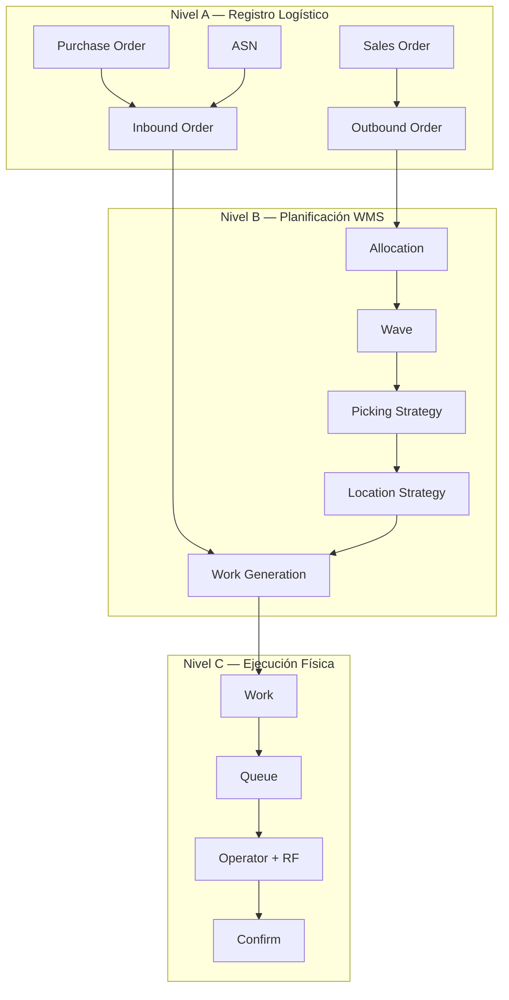
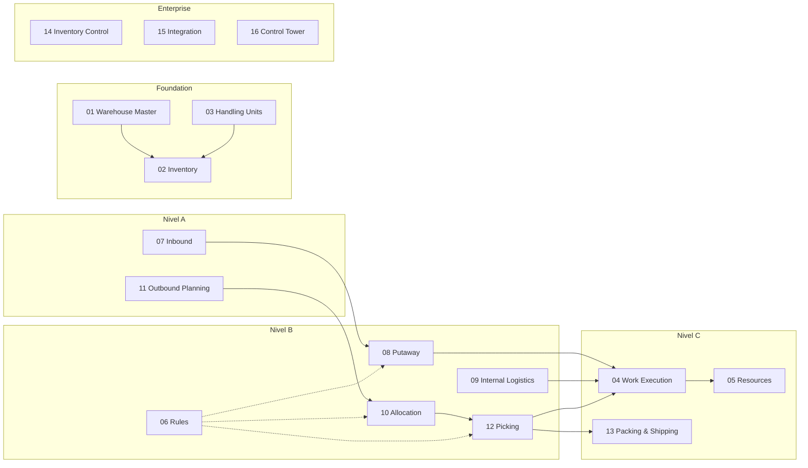

# Niveles Lógicos y Mapa del Producto

> El WMS se estructura en tres niveles lógicos y 16 macrodominios que cubren todas las operaciones de un almacén industrial.

---

## Contexto

Un WMS industrial no es una sola aplicación monolítica. Es un sistema compuesto por múltiples dominios funcionales que operan en distintos niveles de abstracción. Entender esta separación es fundamental para diseñar correctamente las interfaces entre componentes y para determinar qué construimos nosotros vs. qué reutilizamos de Odoo.

---

## Los Tres Niveles Lógicos del WMS

### Nivel A — Registro Logístico (*Logistics Record*)

Representa **qué debe suceder**: la intención de negocio.

Este nivel contiene las entidades que reflejan decisiones comerciales y logísticas. No describen *cómo* se ejecuta el trabajo, sino *qué* se necesita.

| Entidad | En inglés | Significado |
|---|---|---|
| **Orden de Compra** | Purchase Order | Solicitud formal de adquisición de mercadería a un proveedor |
| **ASN** | Advanced Shipping Notice | Aviso anticipado de envío: documento que el proveedor envía antes de despachar la mercadería, detallando qué viene, en qué cantidades y cuándo |
| **Orden de Entrada** | Inbound Order | Instrucción de recibir mercadería en el almacén |
| **Orden de Venta** | Sales Order | Pedido de un cliente que genera demanda de despacho |
| **Orden de Salida** | Outbound Order | Instrucción de despachar mercadería desde el almacén |
| **Transferencia** | Transfer | Movimiento de inventario entre bodegas o ubicaciones |
| **Devolución** | Return | Mercadería que regresa al almacén desde un cliente o destino |
| **Embarque** | Shipment | Agrupación de mercadería que viaja junta en un mismo transporte |

**Relación con Odoo**: en este nivel Odoo tiene bastante infraestructura reutilizable — `purchase.order`, `sale.order`, `stock.picking` ya modelan varios de estos conceptos.

---

### Nivel B — Planificación WMS (*WMS Planning*)

Determina **cómo debería ejecutarse**: la estrategia operacional.

Este nivel toma las intenciones del Nivel A y las transforma en un plan de acción. Aquí es donde empezamos a construir nuestro WMS, porque Odoo estándar no tiene estos motores.

```text
Pedido (Nivel A)
  ↓
Allocation (asignar inventario)
  ↓
Wave (agrupar en ola operativa)
  ↓
Picking Strategy (estrategia de recolección)
  ↓
Location Strategy (estrategia de ubicación)
  ↓
Work Generation (generación de trabajo)
```

| Concepto | En inglés | Significado |
|---|---|---|
| **Asignación** | Allocation | Proceso de determinar qué inventario específico (lote, ubicación, pallet) se compromete para cumplir una demanda |
| **Ola** | Wave | Agrupación de múltiples pedidos u órdenes en una unidad operativa que se procesa conjuntamente (ej: todos los pedidos para un mismo carrier que sale a las 16:00) |
| **Estrategia de Picking** | Picking Strategy | Método para recolectar mercadería: discreto (un pedido a la vez), por lote (batch), por zona, cluster, etc. |
| **Estrategia de Ubicación** | Location Strategy | Reglas que determinan desde dónde tomar el inventario (FIFO, FEFO, más cercano, pallet completo, etc.) |
| **Generación de Trabajo** | Work Generation | Proceso de crear unidades de trabajo ejecutables (`wms.work`) a partir del plan |

---

### Nivel C — Ejecución Física (*Physical Execution*)

Representa **qué está haciendo el operador ahora**: la realidad en el piso del almacén.

Este nivel es donde ocurre la mayor diferencia respecto de Odoo Inventory estándar. Cada acción física es dirigida, registrada y validada.

```text
Work (trabajo asignado)
 ↓
Queue (cola de distribución)
 ↓
Operator (operador recibe trabajo)
 ↓
Equipment (equipo que utiliza)
 ↓
RF (terminal de radiofrecuencia)
 ↓
Scan (escaneo de validación)
 ↓
Pick/Put (acción física)
 ↓
Confirm (confirmación)
```

| Concepto | En inglés | Significado |
|---|---|---|
| **Trabajo** | Work | Unidad de ejecución que indica al operador qué hacer: origen, destino, producto, cantidad |
| **Cola** | Queue | Estructura que organiza trabajos pendientes y los distribuye a recursos compatibles |
| **Operador** | Operator | Persona que ejecuta trabajo en el almacén |
| **Equipo** | Equipment | Maquinaria o herramienta: montacarga (*forklift*), transpaleta (*pallet jack*), AGV (*Automated Guided Vehicle*) |
| **RF** | Radio Frequency | Terminal portátil con pantalla, teclado y escáner que el operador usa para recibir instrucciones y confirmar acciones |
| **Escaneo** | Scan | Lectura de código de barras para validar producto, ubicación, lote o HU |
| **Confirmación** | Confirm | Registro de que la acción física fue completada |

**Referencia**: SAP EWM sigue un patrón similar donde los Warehouse Tasks se agrupan en Warehouse Orders y se asignan a queues/resources; el sistema RF puede seleccionar automáticamente el Warehouse Order más apropiado para cada recurso.

---

## Diagrama de Interacción entre Niveles



---

## Mapa Completo del Producto: 16 Macrodominios

Antes de pensar en fases de implementación, el WMS se define en **16 macrodominios** funcionales. Cada uno encapsula un área de responsabilidad claramente delimitada.

### Dominios Principales

| # | Dominio | En inglés | Qué gestiona |
|---|---------|-----------|-------------|
| 01 | **Maestro de Bodega** | Warehouse Master | Estructura física: bodegas, zonas, pasillos, racks, bins, docks |
| 02 | **Inventario** | Inventory | Stock actual, estados, disponibilidad, reservas, trazabilidad |
| 03 | **Unidades de Manejo** | Handling Units | Pallets, cajas, contenedores, jerarquía de empaque, SSCC |
| 04 | **Ejecución de Trabajo** | Work Execution | Creación, asignación y ciclo de vida del trabajo dirigido |
| 05 | **Recursos** | Resources | Operadores, equipos, certificaciones, disponibilidad |
| 06 | **Reglas** | Rules | Políticas configurables para putaway, allocation, picking, etc. |
| 07 | **Entrada** | Inbound | Recepción: ASN, descarga, verificación, discrepancias |
| 08 | **Almacenamiento** | Putaway | Determinación de ubicación de almacenamiento |
| 09 | **Logística Interna** | Internal Logistics | Reposición (*replenishment*), reubicación, slotting |
| 10 | **Asignación** | Allocation | Selección de inventario para cumplir demanda |
| 11 | **Planificación de Salida** | Outbound Planning | Release de órdenes, waves, priorización |
| 12 | **Picking** | Picking | Recolección de mercadería con múltiples estrategias |
| 13 | **Empaque y Despacho** | Packing & Shipping | Empaque, staging, carga, cierre de embarque |
| 14 | **Control de Inventario** | Inventory Control | Conteos cíclicos, ajustes, precisión |
| 15 | **Integración** | Integration | APIs, contratos, inbox/outbox, idempotencia |
| 16 | **Torre de Control** | Control Tower | Monitoreo operacional en tiempo real |

### Dominios Transversales

Estos dominios **cruzan** a todos los anteriores y no son funcionalidades puntuales sino capacidades que permean toda la plataforma:

| Dominio Transversal | En inglés | Qué asegura |
|---|---|---|
| **Seguridad** | Security | RBAC (*Role-Based Access Control* / Control de acceso basado en roles), permisos granulares |
| **Auditoría** | Audit | Registro inmutable de quién hizo qué, cuándo y desde dónde |
| **Observabilidad** | Observability | Métricas técnicas y de negocio para monitoreo y alertas |
| **Concurrencia** | Concurrency | Manejo de múltiples operadores trabajando simultáneamente sin conflictos |
| **Mensajería** | Messaging | Comunicación asíncrona entre componentes (broker, eventos) |
| **Kubernetes** | Kubernetes | Orquestación de contenedores, escalabilidad, alta disponibilidad |
| **Testing** | Testing | Pruebas unitarias, integración, concurrencia y performance |
| **Gobierno de Datos** | Data Governance | Retención, particionamiento, calidad de datos |
| **Performance** | Performance | Optimización de queries, índices, caching |
| **Alta Disponibilidad** | High Availability | Tolerancia a fallos de pods, nodos y componentes |
| **Recuperación ante Desastres** | Disaster Recovery | Backup, restore, failover a sitio secundario |

---

## Relación entre Niveles y Macrodominios



---

## Cuatro Niveles de Definición del Producto

El sistema se construirá progresivamente en cuatro niveles de definición:

| Nivel | Pregunta que responde | Resultado |
|---|---|---|
| **Nivel 0 — Producto** | ¿Qué WMS queremos construir? | Visión, alcance, capacidades |
| **Nivel 1 — Arquitectura** | ¿Qué dominios y motores tendrá? | Mapa de dominios, bounded contexts |
| **Nivel 2 — Diseño Funcional/Técnico** | ¿Cómo funciona cada dominio? | Entidades, estados, flujos, reglas, APIs |
| **Nivel 3 — Implementación** | ¿Cómo lo codificamos? | Módulos Odoo, modelos, APIs, eventos, tests, infra, tareas |

> **El error sería saltar inmediatamente al Nivel 3.** Sin los niveles previos, el desarrollo carecería de dirección coherente.

---

## Referencias

- [SAP EWM — Warehouse Order](https://help.sap.com/docs/SAP_SUPPLY_CHAIN_MANAGEMENT/dc8e3ce481cc493aad2145b99e6c53eb/3d267d0c-463f-4bf5-b2b9-a72eac15dccc.html)
- [Dynamics 365 — Warehouse Management Overview](https://learn.microsoft.com/en-us/dynamics365/supply-chain/warehousing/warehouse-management-overview)

---

*Documento derivado de las secciones 2-3 del [Plan Maestro](../plan.md).*
