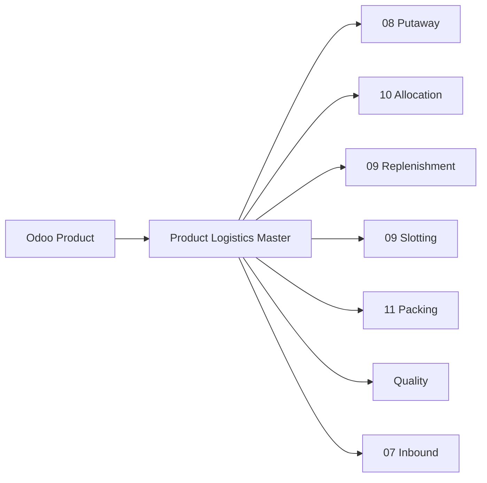

# Product Logistics Master — Perfil Logístico del Producto

> Dominio que define el perfil logístico WMS de cada producto: UOM operacionales, configuración de pallet, clasificaciones de rotación, restricciones de almacenamiento y perfiles de putaway/allocation/replenishment. Sin este dominio, los motores de Putaway, Allocation, Replenishment y Slotting no tienen información suficiente para operar.

---

## Contexto

### ¿Por qué es un dominio del Kernel?

> **ADR-024**: Product Logistics Profile es parte del WMS Kernel.

Los motores WMS necesitan datos del producto que Odoo no gestiona:

| Motor | Dato que necesita | ¿Odoo lo tiene? |
|---|---|---|
| **Putaway** | Clase de temperatura, clase hazmat, tipo de HU permitido | ❌ |
| **Allocation** | Shelf life mínima al despachar, clase ABC | ❌ |
| **Replenishment** | UOM de pick face, qty por case, cases por pallet | ❌ parcial |
| **Slotting** | Velocidad, afinidad entre productos, estacionalidad | ❌ |
| **Packing** | Dimensiones de cada packaging, apilabilidad | ❌ parcial |
| **Quality** | ¿Requiere inspección? ¿Qué tipo? | ❌ |

Sin un **perfil logístico WMS**, cada motor tendría que buscar esta información de forma ad-hoc, generando inconsistencias.

---

## Lo que Odoo 19 YA posee

Reutilizamos extensivamente los modelos de producto de Odoo:

| Modelo / Campo | Significado | Lo reutilizamos |
|---|---|---|
| `product.template` / `product.product` | Maestro de productos | ✅ |
| `product.template.tracking` | Control: none / lot / serial | ✅ |
| `product.template.weight` | Peso del producto | ✅ |
| `product.template.volume` | Volumen del producto | ✅ |
| `product.template.barcode` | Código de barras | ✅ |
| `product.template.categ_id` | Categoría | ✅ |
| `uom.uom` / `product.template.uom_id` | Unidad de medida base | ✅ |
| `product.template.uom_po_id` | UOM de compra | ✅ |
| `product.packaging` | Packaging definidos: nombre, qty, barcode | ✅ |
| `stock.lot.use_expiration_date` | Control de expiración | ✅ |
| `stock.lot.expiration_date` | Fecha de expiración | ✅ |
| `stock.lot.use_date` | Best before date | ✅ |
| `stock.lot.removal_date` | Fecha de remoción | ✅ |
| `stock.lot.alert_date` | Fecha de alerta | ✅ |

---

## Lo que el WMS agrega: `wms.product.logistics`

Modelo nuevo, **one-to-one con `product.template`**, que contiene toda la información logística WMS:

### Identificación y Códigos

| Campo | En inglés | Significado |
|---|---|---|
| `product_tmpl_id` | Product Template | Relación al producto de Odoo |
| `gtin` | Global Trade Item Number | Código GTIN del producto |
| `additional_barcodes` | Additional Barcodes | Códigos de barras alternativos |

### UOM Operacionales

Odoo gestiona UOM base y de compra. El WMS necesita UOM adicionales para operaciones:

| Campo | En inglés | Significado | Ejemplo |
|---|---|---|---|
| `pick_uom_id` | Pick UOM | Unidad en que se recolecta normalmente | Unidad, caja inner |
| `case_uom_id` | Case UOM | Unidad de caja (case) | Caja de 12 |
| `pallet_uom_id` | Pallet UOM | Unidad de pallet | Pallet de 48 cajas |

Estos se apoyan en `product.packaging` de Odoo para la conversión:

```text
product.packaging "Inner Box": qty=6, barcode=7890001
product.packaging "Case":      qty=12, barcode=7890002
product.packaging "Pallet":    qty=576 (12 × 48)

wms.product.logistics:
  pick_uom → references packaging "Inner Box"
  case_uom → references packaging "Case"
  pallet_uom → references packaging "Pallet"
```

### Configuración de Pallet (Ti-Hi)

| Campo | En inglés | Significado | Ejemplo |
|---|---|---|---|
| `units_per_case` | Units per Case | Unidades por caja | 12 |
| `cases_per_layer` | Cases per Layer (Ti) | Cajas por capa del pallet | 8 |
| `layers_per_pallet` | Layers per Pallet (Hi) | Capas por pallet | 6 |
| `units_per_pallet` | Units per Pallet | Computed: units × cases × layers | 576 |

### Dimensiones Logísticas

| Campo | En inglés | Significado |
|---|---|---|
| `case_length`, `case_width`, `case_height` | Case Dimensions | Dimensiones de la caja |
| `case_weight` | Case Weight | Peso de la caja |
| `pallet_length`, `pallet_width`, `pallet_height` | Pallet Dimensions | Dimensiones del pallet armado |
| `pallet_weight` | Pallet Weight | Peso del pallet armado |
| `stackable` | Stackable | ¿Se puede apilar? |
| `max_stack` | Max Stack | Máximo de niveles de apilado |
| `fragile` | Fragile | ¿Es frágil? |

### Clasificaciones Operacionales

| Campo | En inglés | Significado | Valores |
|---|---|---|---|
| `abc_class` | ABC Class | Clasificación por valor/rotación | `A`, `B`, `C` |
| `velocity_class` | Velocity Class | Velocidad de movimiento | `FAST`, `MEDIUM`, `SLOW`, `DEAD` |
| `temperature_class` | Temperature Class | Requisito de temperatura | `AMBIENT`, `CHILLED`, `FROZEN`, `ULTRA_FROZEN` |
| `hazmat_class` | Hazardous Material Class | Clase de material peligroso | `NONE`, `CLASS_1` a `CLASS_9` |

### Control de Vida Útil

| Campo | En inglés | Significado | Ejemplo |
|---|---|---|---|
| `min_shelf_life_receipt` | Min Shelf Life at Receipt | Vida útil mínima para aceptar en recepción | 180 días |
| `min_shelf_life_shipping` | Min Shelf Life at Shipping | Vida útil mínima al despachar al cliente | 90 días |
| `shelf_life_uom` | Shelf Life UOM | Unidad de la vida útil | Días |

### Restricciones de HU

| Campo | En inglés | Significado |
|---|---|---|
| `allowed_hu_types` | Allowed HU Types | Tipos de `stock.package.type` permitidos |
| `default_hu_type` | Default HU Type | Tipo de HU por defecto al recibir |

### Perfiles WMS

| Campo | En inglés | Significado |
|---|---|---|
| `storage_profile` | Storage Profile | Perfil de almacenamiento (linked to putaway rules) |
| `putaway_profile` | Putaway Profile | Perfil de putaway (zona preferida, tipo de rack, etc.) |
| `replenishment_profile` | Replenishment Profile | Perfil de reposición (min/max de pick face) |
| `allocation_profile` | Allocation Profile | Perfil de asignación (FIFO/FEFO/estrategia preferida) |

### Inspección

| Campo | En inglés | Significado |
|---|---|---|
| `requires_quality_inspection` | Requires Quality Inspection | ¿Requiere inspección al recibir? |
| `quality_inspection_type` | Quality Inspection Type | Tipo de inspección: visual, dimensional, muestreo |
| `quality_sampling_rate` | Quality Sampling Rate | Porcentaje de muestreo |

---

## Relación con Odoo

### Modelos Reutilizados

| Modelo | Qué reutilizamos |
|---|---|
| `product.product` / `product.template` | Maestro de productos |
| `product.packaging` | Packaging con qty y barcode |
| `uom.uom` | Unidades de medida |
| `stock.lot` | Lotes con fechas de expiración |

### Modelos Nuevos

| Modelo | Propósito |
|---|---|
| `wms.product.logistics` | Perfil logístico WMS — one-to-one con `product.template` |

---

## Dependencias



---

*Documento nuevo para v1.1 — ADR-024.*
