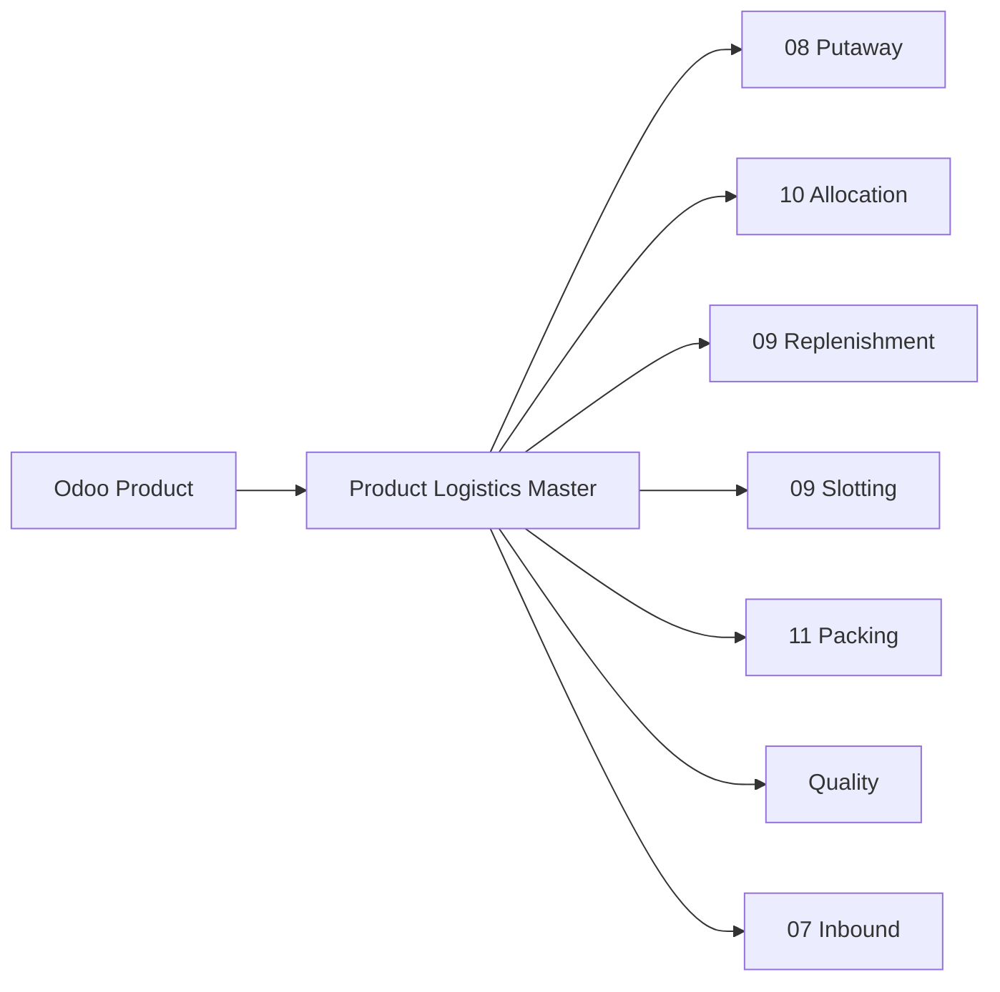

# Product Logistics Master — Perfil Logístico del Producto

> Dominio que define el perfil logístico WMS de cada producto: UOM operacionales, configuración de pallet, clasificaciones de rotación, restricciones de almacenamiento y perfiles de putaway/allocation/replenishment. Sin este dominio, los motores de Putaway, Allocation, Replenishment y Slotting no tienen información suficiente para operar.

---

## Contexto

### ¿Por qué es un dominio del Kernel?

> **ADR-024**: Product Logistics Profile es parte del WMS Kernel.

Los motores WMS necesitan datos del producto que Odoo no gestiona:

| Motor | Dato que necesita | ¿Odoo lo tiene? |
|---|---|---|
| **Putaway** | Clase de temperatura, clase hazmat, tipo de HU permitido | ❌ |
| **Allocation** | Shelf life mínima al despachar, clase ABC | ❌ |
| **Replenishment** | UOM de pick face, qty por case, cases por pallet | ❌ parcial |
| **Slotting** | Velocidad, afinidad entre productos, estacionalidad | ❌ |
| **Packing** | Dimensiones de cada packaging, apilabilidad | ❌ parcial |
| **Quality** | ¿Requiere inspección? ¿Qué tipo? | ❌ |

Sin un **perfil logístico WMS**, cada motor tendría que buscar esta información de forma ad-hoc, generando inconsistencias.

---

## Lo que Odoo 19 YA posee

Reutilizamos extensivamente los modelos de producto de Odoo:

| Modelo / Campo | Significado | Lo reutilizamos |
|---|---|---|
| `product.template` / `product.product` | Maestro de productos | ✅ |
| `product.template.tracking` | Control: none / lot / serial | ✅ |
| `product.template.weight` | Peso del producto | ✅ |
| `product.template.volume` | Volumen del producto | ✅ |
| `product.template.barcode` | Código de barras | ✅ |
| `product.template.categ_id` | Categoría | ✅ |
| `uom.uom` / `product.template.uom_id` | Unidad de medida base | ✅ |
| `product.template.uom_ids` | Packagings adicionales (Many2many `uom.uom`) | ✅ |
| `product.uom` | Asociación variante + UOM + barcode de packaging | ✅ |
| `stock.lot.use_expiration_date` | Control de expiración | ✅ |
| `stock.lot.expiration_date` | Fecha de expiración | ✅ |
| `stock.lot.use_date` | Best before date | ✅ |
| `stock.lot.removal_date` | Fecha de remoción | ✅ |
| `stock.lot.alert_date` | Fecha de alerta | ✅ |

---

## Lo que el WMS agrega: `wms.product.logistics`

Modelo nuevo, **one-to-one con `product.template`**, que contiene toda la información logística WMS:

### Identificación y Códigos

| Campo | En inglés | Significado |
|---|---|---|
| `product_tmpl_id` | Product Template | Relación al producto de Odoo |
| `gtin` | Global Trade Item Number | Código GTIN del producto |
| `additional_barcodes` | Additional Barcodes | Códigos de barras alternativos |

### UOM Operacionales (PLM-003A)

> **Corrección v1.3 (PLM-003A):** La v1.2 proponía `product.packaging` como FK.
> La verificación del pinned Odoo 19 (`95f76213d3f...`) demostró que
> `product.packaging` no existe. En su lugar, Odoo 19 usa:
>
> - `product.template.uom_id` → UOM base (required, Many2one `uom.uom`)
> - `product.template.uom_ids` → Packagings adicionales (Many2many `uom.uom`)
> - `product.uom` → Asociación variante + UOM + barcode (para resolución de barcodes)

El WMS referencia **`uom.uom`** para roles operacionales:

| Campo | En inglés | Significado | Referencia a | Semántica |
|---|---|---|---|---|
| `pick_uom_id` | Pick UOM | UOM de pick | `uom.uom` | uom_id (base) O uom_ids |
| `case_uom_id` | Case UOM | UOM de case | `uom.uom` | sólo uom_ids |
| `pallet_uom_id` | Pallet UOM | UOM de pallet | `uom.uom` | sólo uom_ids |

```text
product.template "SKU-A":
  uom_id = Units (base)
  uom_ids = [Box of 12, Case of 24, Pallet of 576]

wms.product.logistics:
  pick_uom_id   → Units (base) o Box of 12
  case_uom_id   → Case of 24
  pallet_uom_id → Pallet of 576
```

La UOM base del producto (`product.template.uom_id`) se reutiliza de Odoo sin modificación.

### Configuración de Pallet (Ti-Hi) y Cantidades Derivadas (PLM-003B)

> **Principio de Diseño:** Odoo `uom.uom` mantiene la verdad cuantitativa del packaging (mediante factores de conversión y `_compute_quantity()`). El WMS sólo almacena la geometría física Ti/Hi y deriva las cantidades en tiempo real (non-stored, readonly).

#### Configuración WMS (Persistente)

| Campo | En inglés | Significado | Tipo | Ejemplo |
|---|---|---|---|---|
| `cases_per_layer` | Cases per Layer (Ti) | Cajas por capa del pallet (Ti) | `Integer` | 8 |
| `layers_per_pallet` | Layers per Pallet (Hi) | Capas por pallet (Hi) | `Integer` | 6 |

#### Cantidades Derivadas de Odoo UOM (Compute, Non-Stored, Readonly)

| Campo | En inglés | Significado | Derivación | Ejemplo |
|---|---|---|---|---|
| `base_qty_per_case` | Base Qty per Case | Unidades base por caja | `case_uom_id → uom_id` | 12.0 |
| `cases_per_pallet` | Cases per Pallet | Cajas por pallet | `pallet_uom_id → case_uom_id` | 48.0 |
| `base_qty_per_pallet` | Base Qty per Pallet | Unidades base por pallet | `pallet_uom_id → uom_id` | 576.0 |

> **Invariante de Reconciliación:** Si Ti y Hi están configurados (> 0), se valida server-side que `Ti × Hi == cases_per_pallet`.

### Clasificaciones Operacionales (PLM-004)

> Atributos maestros explícitos para motores WMS (Putaway, Allocation, Slotting). Son opcionales y sin derivación automática.

| Campo | En inglés | Significado | Tipo | Valores / Catálogo |
|---|---|---|---|---|
| `abc_class` | ABC Class | Clasificación por valor/rotación | `Selection` | `A`, `B`, `C` |
| `velocity_class` | Velocity Class | Velocidad de movimiento | `Selection` | `FAST`, `MEDIUM`, `SLOW`, `DEAD` |
| `temperature_class` | Temperature Class | Requisito de temperatura | `Selection` | `AMBIENT`, `CHILLED`, `FROZEN`, `ULTRA_FROZEN` |
| `hazmat_class` | Hazardous Material Class | Clase de material peligroso | `Selection` | `NONE`, `CLASS_1` a `CLASS_9` |

### Atributos de Manejo / Handling (PLM-004)

> Reglas de apilabilidad y fragilidad física para almacenamiento y transporte.

| Campo | En inglés | Significado | Tipo | Reglas / Invariantes |
|---|---|---|---|---|
| `stackable` | Stackable | ¿Es físicamente apilable? | `Boolean` | `False` requiere `max_stack=0`; `True` requiere `max_stack>=2` |
| `max_stack` | Max Stack | Máximo número de niveles de apilado | `Integer` | `max_stack >= 0` protegido por DB CHECK |
| `fragile` | Fragile | ¿Requiere manipulación como frágil? | `Boolean` | Independiente de `stackable` |

### Dimensiones y Pesos Físicos (Diferido a etapa posterior)

> Las dimensiones y pesos logísticos de caja y pallet armado quedan diferidos para su implementación dedicada.

| Campo | En inglés | Significado | Estado |
|---|---|---|---|
| `case_length`, `case_width`, `case_height` | Case Dimensions | Dimensiones de la caja | ⏳ Diferido |
| `case_weight` | Case Weight | Peso de la caja | ⏳ Diferido |
| `pallet_length`, `pallet_width`, `pallet_height` | Pallet Dimensions | Dimensiones del pallet armado | ⏳ Diferido |
| `pallet_weight` | Pallet Weight | Peso del pallet armado | ⏳ Diferido |

### Control de Vida Útil / Shelf-Life Policy (PLM-005A)

> **Principio de Diseño:** Odoo conserva la verdad de las fechas de expiración (`stock.lot`: `expiration_date`, `use_date`, `removal_date`, `alert_date`). El WMS almacena únicamente los mínimos de vida restante requeridos expresados directamente en **días**. Un valor de `0` indica sin restricción mínima configurada.

| Campo | En inglés | Significado | Tipo | Ejemplo |
|---|---|---|---|---|
| `min_shelf_life_receipt_days` | Min Shelf Life at Receipt (Days) | Vida útil mínima requerida al recibir en recepción | `Integer` | 180 días (0 = sin mínimo) |
| `min_shelf_life_shipping_days` | Min Shelf Life at Shipping (Days) | Vida útil mínima requerida al despachar al cliente | `Integer` | 90 días (0 = sin mínimo) |

> **Invariantes:**
> - Ambos umbrales son independientes y no imponen orden relativo.
> - Valores negativos están protegidos y rechazados por DB CHECK.
> - No se duplican fechas de expiración en el perfil WMS; la validación de lotes se ejecuta en motores Inbound/Outbound correspondientes.

### Restricciones de HU

| Campo | En inglés | Significado |
|---|---|---|
| `allowed_hu_types` | Allowed HU Types | Tipos de `stock.package.type` permitidos |
| `default_hu_type` | Default HU Type | Tipo de HU por defecto al recibir |

### Perfiles WMS

| Campo | En inglés | Significado |
|---|---|---|
| `storage_profile` | Storage Profile | Perfil de almacenamiento (linked to putaway rules) |
| `putaway_profile` | Putaway Profile | Perfil de putaway (zona preferida, tipo de rack, etc.) |
| `replenishment_profile` | Replenishment Profile | Perfil de reposición (min/max de pick face) |
| `allocation_profile` | Allocation Profile | Perfil de asignación (FIFO/FEFO/estrategia preferida) |

### Inspección

| Campo | En inglés | Significado |
|---|---|---|
| `requires_quality_inspection` | Requires Quality Inspection | ¿Requiere inspección al recibir? |
| `quality_inspection_type` | Quality Inspection Type | Tipo de inspección: visual, dimensional, muestreo |
| `quality_sampling_rate` | Quality Sampling Rate | Porcentaje de muestreo |

---

## Relación con Odoo

### Modelos Reutilizados

| Modelo | Qué reutilizamos |
|---|---|
| `product.product` / `product.template` | Maestro de productos |
| `uom.uom` | Unidades de medida + packagings (via `uom_ids`) |
| `product.uom` | Asociación variante + UOM + barcode |
| `stock.lot` | Lotes con fechas de expiración |

### Modelos Nuevos

| Modelo | Propósito |
|---|---|
| `wms.product.logistics` | Perfil logístico WMS — one-to-one con `product.template` |

---

## Dependencias



---

*Documento nuevo para v1.1 — ADR-024.*
