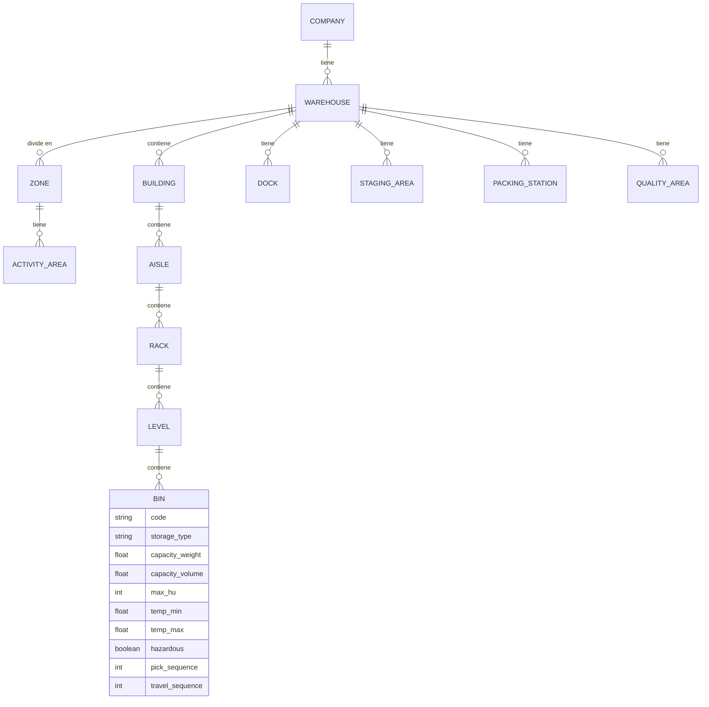
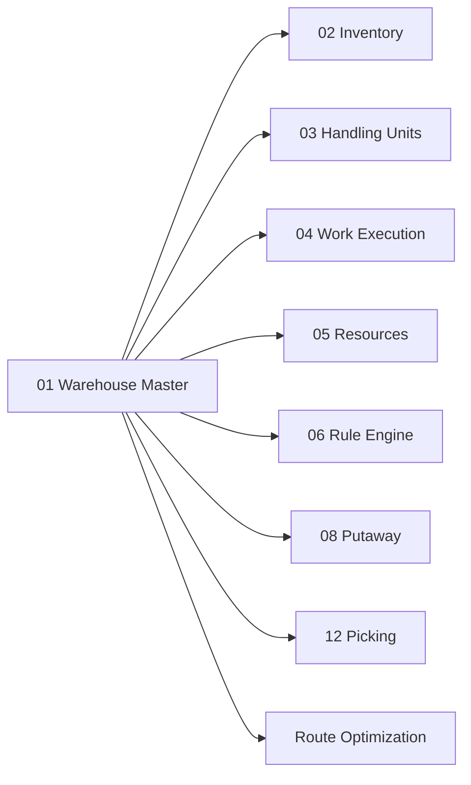

# Warehouse Master — Maestro de Bodega

> Representación digital de la bodega física: la base sobre la que todos los algoritmos WMS toman decisiones.

---

## Contexto

Antes de que cualquier motor WMS pueda decidir *dónde almacenar*, *desde dónde recolectar* o *cómo asignar trabajo*, necesita una representación completa y operacional de la bodega física. Odoo estándar maneja warehouses y ubicaciones jerárquicas (`stock.warehouse`, `stock.location`), pero su modelo es insuficiente para un WMS industrial que requiere conocer capacidades, restricciones y topología.

---

## Propósito

Crear la **representación digital del almacén físico** con suficiente detalle para que cualquier algoritmo WMS pueda responder preguntas operacionales como:

| Pregunta | Motor que la necesita |
|---|---|
| ¿Qué puede guardarse en esta ubicación? | Putaway Engine |
| ¿Puede llegar este equipo a esta ubicación? | Assignment Engine |
| ¿Qué operador trabaja en esta zona? | Resource Engine |
| ¿Qué tan lejos está esta ubicación de otra? | Route Optimization |
| ¿Es una ubicación de picking, reserva, staging o recepción? | Allocation, Wave, Replenishment |

---

## Diseño Funcional

### Jerarquía del Almacén

La estructura jerárquica representa la organización física desde la compañía hasta la ubicación más granular:

```text
Company (Empresa)
 └ Warehouse (Bodega/Almacén)
     ├ Building (Edificio)
     ├ Zone (Zona)
     ├ Activity Area (Área de Actividad)
     ├ Aisle (Pasillo)
     ├ Rack (Estantería)
     ├ Level (Nivel de estantería)
     ├ Bin (Posición específica dentro de un nivel)
     ├ Dock (Muelle de carga/descarga)
     ├ Staging (Área de preparación)
     ├ Packing Station (Estación de empaque)
     └ Quality Area (Área de control de calidad)
```

### Glosario de Entidades

| Entidad | En inglés | Definición |
|---|---|---|
| **Bodega** | Warehouse | Instalación física completa donde se almacena y procesa mercadería |
| **Edificio** | Building | Estructura física dentro de un complejo que puede tener múltiples naves |
| **Zona** | Zone | Agrupación lógica de ubicaciones con características comunes (ej: zona de congelados, zona de inflamables, zona de alta rotación) |
| **Área de Actividad** | Activity Area | Subdivisión de una zona según la actividad que se realiza (ej: recepción, almacenamiento, picking, despacho) |
| **Pasillo** | Aisle | Corredor entre estanterías por donde transitan operadores y equipos |
| **Estantería** | Rack | Estructura metálica que contiene múltiples niveles de almacenamiento |
| **Nivel** | Level | Cada piso horizontal dentro de una estantería |
| **Posición** | Bin | La ubicación más granular: un espacio específico en un nivel de una estantería |
| **Muelle** | Dock | Puerta de la bodega donde se estacionan camiones para carga/descarga |
| **Área de Preparación** | Staging | Zona temporal donde se acumula mercadería antes de cargarla en un transporte |
| **Estación de Empaque** | Packing Station | Puesto de trabajo fijo donde se empaca y se preparan los paquetes |
| **Área de Calidad** | Quality Area | Zona donde se retiene mercadería pendiente de inspección |

---

### Capacidades por Ubicación

Cada ubicación no es simplemente un nombre. Tiene **capacidades operacionales** que los algoritmos consultan:

| Capacidad | En inglés | Significado | Ejemplo |
|---|---|---|---|
| **Tipo de almacenamiento** | Storage Type | Clasificación de la ubicación según qué puede almacenar | `PALLET`, `SHELF`, `FLOOR`, `COLD` |
| **Zona** | Zone | A qué zona pertenece | `FREEZER`, `DRY`, `HAZMAT` |
| **Capacidad peso** | Capacity Weight | Peso máximo que soporta | 2,000 kg |
| **Capacidad volumen** | Capacity Volume | Volumen máximo | 4.8 m³ |
| **Máximo HU** | Maximum HU | Cantidad máxima de unidades de manejo (*Handling Units*) que caben | 2 pallets |
| **Rango temperatura** | Temperature Range | Rango permitido de temperatura | -20°C a -18°C |
| **Compatibilidad materiales peligrosos** | Hazardous Compatibility | Si puede almacenar materiales peligrosos y de qué clase | Clase 3 (líquidos inflamables) |
| **Productos permitidos** | Allowed Products | Lista de productos específicos permitidos | Solo SKU de categoría X |
| **Tipos de HU permitidos** | Allowed HU Types | Qué tipos de unidades de manejo acepta | Solo pallets americanos |
| **Secuencia de picking** | Pick Sequence | Orden numérico para recorrido de picking | 001, 002, 003... |
| **Secuencia de viaje** | Travel Sequence | Orden optimizado para minimizar desplazamientos | Depende del algoritmo de ruta |
| **Perfil de reposición** | Replenishment Profile | Reglas de reposición automática (mín/máx) | min=100, max=600 |
| **Perfil de almacenamiento** | Putaway Profile | Reglas que determinan si un producto puede ir aquí | Prioridad, restricciones |

---

### Diagrama de Relaciones



---

## Relación con Odoo

### Modelos Reutilizados

| Modelo Odoo | Qué nos aporta |
|---|---|
| `stock.warehouse` | Estructura base de bodega: nombre, código, company |
| `stock.location` | Jerarquía de ubicaciones con relación padre-hijo |

### Modelos Extendidos

No crearemos modelos paralelos. **Extenderemos** los existentes con campos adicionales:

| Modelo | Extensión WMS |
|---|---|
| `stock.warehouse` | Campos para building, configuración WMS, timezone, horarios |
| `stock.location` | Storage type, zone, capacidades (peso, volumen, HU), temperatura, hazardous, secuencias, perfiles |

### Modelos Nuevos Propuestos

| Modelo | Propósito |
|---|---|
| `wms.zone` | Definición de zonas con sus reglas y restricciones |
| `wms.activity.area` | Áreas de actividad dentro de cada zona |
| `wms.dock` | Muelles con estado, tipo (inbound/outbound), capacidades |
| `wms.storage.type` | Catálogo de tipos de almacenamiento |

---

## Dependencias



**Warehouse Master no depende de ningún otro dominio WMS**, pero prácticamente todos los demás dominios dependen de él. Es la **base** de toda la plataforma.

---

## Por qué hacerlo así

Los algoritmos de putaway, picking, slotting, replenishment y routing necesitan una **representación operacional** de la bodega, no solamente un nombre de ubicación. Sin las capacidades detalladas de cada ubicación, los motores de decisión no podrían funcionar correctamente.

Un WMS que solo conoce "Ubicación A03" no puede decidir si un pallet de 1,500 kg de producto congelado puede almacenarse ahí. Necesita saber:
- ¿Soporta el peso? → `capacity_weight >= 1500`
- ¿Tiene temperatura adecuada? → `temp_range = FROZEN`
- ¿Cabe un pallet? → `max_hu > 0` y `allowed_hu_types includes PALLET`

---

## Referencias

- [Odoo 19 — Warehouses](https://www.odoo.com/documentation/19.0/applications/inventory_and_mrp/inventory/warehouses_storage/inventory_management/warehouses.html)

---

*Documento derivado de la sección 4 del [Plan Maestro](../plan.md).*
