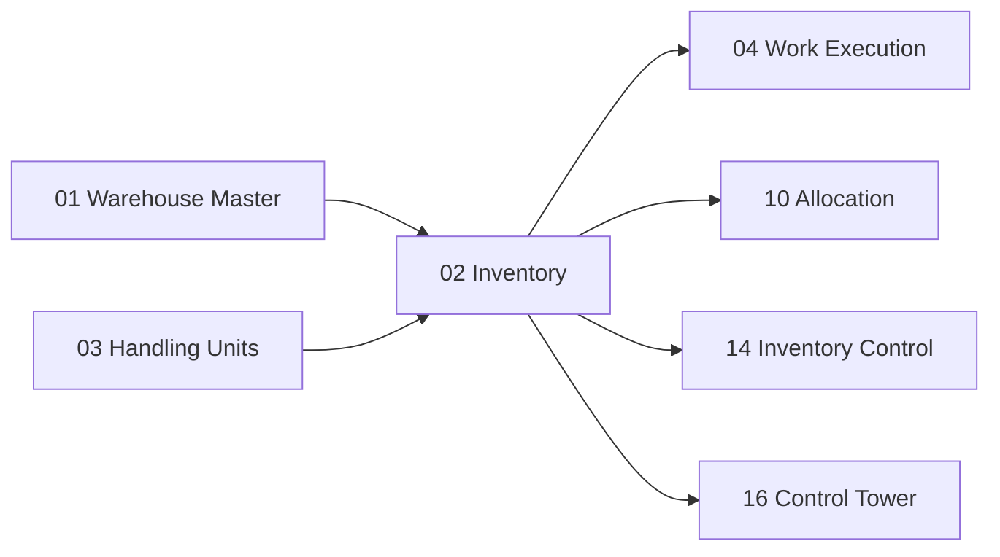

# Inventory Domain — Dominio de Inventario (v1.1)

> El inventario es la fuente de verdad del WMS. Odoo `stock.quant` sigue siendo el registro maestro. Los estados operacionales WMS **no se agregan al quant** sino que se implementan mediante ubicaciones especializadas, políticas WMS y modelos independientes.

---

## Contexto

El inventario es el activo más protegido del sistema. Cada decisión que toma el WMS — desde dónde almacenar hasta qué recolectar — depende de datos de inventario precisos, actualizados y confiables. Un error en inventario se propaga a todos los procesos downstream.

---

## Propósito

1. Mantener una **fuente de verdad única** del inventario, basada en los modelos transaccionales de Odoo
2. Implementar estados operacionales WMS **sin modificar la identidad lógica del quant**
3. Proveer tres capas de registro distintas: **Operational Event Journal**, **Audit Log** e **Integration Outbox**

---

## Diseño Funcional

### Fuente de Verdad: Modelos de Odoo

La fuente de verdad del inventario **continuará siendo Odoo**. No crearemos una segunda base de inventario.

| Modelo Odoo | En inglés | Qué representa |
|---|---|---|
| `stock.move` | Stock Move | Intención de mover inventario: un registro que dice "X unidades de producto Y deben ir de A a B" |
| `stock.move.line` | Stock Move Line | Detalle del move: lote específico, paquete, cantidad real |
| `stock.quant` | Stock Quant | **Inventario real**: cantidad de un producto en una ubicación específica, con lote y paquete. Es la foto actual del stock |

### Lo que Odoo 19 `stock.quant` YA posee

> [!IMPORTANT]
> La documentación v1.0 proponía agregar campos que **ya existen** en Odoo 19. Esto se corrige aquí.

| Campo | Ya existe | Detalle |
|---|---|---|
| `owner_id` | ✅ **Sí** | Propietario del inventario — soporta 3PL de fábrica |
| `reserved_quantity` | ✅ **Sí** | Cantidad reservada por moves |
| `available_quantity` | ✅ **Sí** | Computed: `quantity - reserved_quantity` |
| `package_id` | ✅ **Sí** | Paquete / HU donde está el inventario |
| `lot_id` | ✅ **Sí** | Lote o número de serie |
| `warehouse_id` | ✅ **Sí** | Bodega |
| `storage_category_id` | ✅ **Sí** | Categoría de almacenamiento |
| `in_date` | ✅ **Sí** | Fecha de ingreso (usado por FIFO/FEFO) |

---

## ⚠️ ADVERTENCIA P0: No modificar la identidad lógica del quant

### El Problema

Odoo consolida quants mediante `_merge_quants()` agrupando por:

```sql
GROUP BY product_id, company_id, location_id, lot_id, package_id, owner_id
```

Si agregáramos `inventory_status` o `quality_status` directamente como campos del quant **sin** modificar toda la lógica interna de gathering, merging, reservations y movimientos:

```text
Quant A: product=SKU-1, location=A03, status=AVAILABLE,   qty=100
Quant B: product=SKU-1, location=A03, status=QUARANTINE,  qty=100
```

Odoo los consideraría el **mismo quant lógico** y podría fusionarlos en uno solo con `qty=200`. Esto corrompería el inventario de forma silenciosa y catastrófica.

### La Solución: Estados WMS sin tocar el quant

> **ADR-011**: No ampliar la identidad lógica de `stock.quant` sin análisis de impacto completo.
>
> **ADR-012**: Inventory Status no vive inicialmente en `stock.quant`.

En lugar de agregar dimensiones al quant, implementamos estados operacionales así:

| Estado WMS | Implementación | Cómo funciona |
|---|---|---|
| **Quality Hold** | Location `usage='internal'` + `wms_location_role='QUALITY_HOLD'` | Odoo sigue tratándola como location interna; el WMS la excluye de allocation |
| **Quarantine** | Location `usage='internal'` + `wms_location_role='QUARANTINE'` | Misma mecánica, allocation la ignora |
| **Damaged** | Location `usage='internal'` + `wms_location_role='DAMAGE'` | Misma mecánica |
| **Available** | Inventario en location con `wms_location_role='STORAGE'` | El estado por defecto |
| **Reserved** | `stock.quant.reserved_quantity` | **Ya lo maneja Odoo** |
| **Ownership** | `stock.quant.owner_id` | **Ya lo maneja Odoo** |
| **HU Context** | `stock.quant.package_id` → `stock.package` | **Ya lo maneja Odoo** |
| **Operational Block** | `wms.inventory.block` (modelo nuevo) | Bloqueo temporal por conteo, investigación, etc. |
| **Reservation Context** | `wms.allocation` (modelo nuevo) | Para qué wave/orden se reservó — NO en el quant |

> **ADR-026 (v1.2)**: `stock.location.usage` conserva la semántica Odoo. `wms_location_role` aporta la semántica WMS.
>
> Odoo verifica internamente `location.usage == 'internal'` para replenishment, quant gathering y otras operaciones. Crear valores nuevos de `usage` rompería esa lógica.
>
> Roles WMS: `STORAGE`, `PICK_FACE`, `QUALITY_HOLD`, `QUARANTINE`, `DAMAGE`, `RECEIVING`, `STAGING`, `PACKING`, `CONSOLIDATION`, `DOCK`, `CROSS_DOCK`

Este enfoque **usa la mecánica de Odoo** (mover inventario a ubicaciones especializadas) en vez de luchar contra ella.

### Ejemplo: Quality Hold

```text
ANTES (status implícito por ubicación):
  stock.quant: SKU-A, Location=A03-R02-L04, Qty=120
  → Disponible (está en ubicación de almacenamiento)

Quality hold trigger:
  stock.move: A03-R02-L04 → WH/QUALITY-HOLD

DESPUÉS:
  stock.quant: SKU-A, Location=WH/QUALITY-HOLD, Qty=120
  → Bloqueado por calidad (está en ubicación de hold)
  → No asignable para picking (allocation ignora QUALITY-HOLD locations)

Quality release:
  stock.move: WH/QUALITY-HOLD → A03-R02-L04
  → De vuelta a disponible
```

### Bloqueo Operacional (`wms.inventory.block`) — v1.2

Para bloqueos que no implican movimiento físico (ej: inventario bloqueado durante conteo):

> ⚠️ La v1.1 usaba `quant_id` como referencia del bloqueo. Esto es frágil porque `stock.quant` es una representación técnica que Odoo puede mergear, crear y eliminar durante la gestión de inventario. Un bloqueo debe referenciar **dimensiones lógicas**, no IDs de registros técnicos.

| Campo | Significado |
|---|---|
| `block_scope` | Scope: `LOCATION`, `PRODUCT_LOCATION`, `LOT`, `PACKAGE`, `OWNER_LOCATION` |
| `product_id` | Producto (si aplica al scope) |
| `location_id` | Ubicación (si aplica al scope) |
| `lot_id` | Lote (si aplica al scope) |
| `package_id` | Package/HU (si aplica al scope) |
| `owner_id` | Propietario (si aplica al scope) |
| `block_type` | Tipo: `CYCLE_COUNT`, `INVESTIGATION`, `HOLD`, `CUSTOMS` |
| `reason` | Motivo del bloqueo |
| `blocked_by` | Usuario que bloqueó |
| `blocked_at` | Timestamp |
| `released_at` | Timestamp de liberación (null = activo) |

Ejemplo — bloquear todo el inventario de una ubicación durante conteo cíclico:

```text
block_scope = LOCATION
location_id = A03-R02-L04
block_type = CYCLE_COUNT
```

Ejemplo — bloquear un lote específico por investigación de calidad:

```text
block_scope = LOT
lot_id = L00231
product_id = SKU-A
block_type = INVESTIGATION
```

El Allocation Engine **consulta** `wms.inventory.block` antes de asignar inventario.

---

## Tres Capas de Registro (v1.1)

> [!IMPORTANT]
> La v1.0 mezclaba tres conceptos distintos bajo "Inventory Ledger". La v1.1 los separa explícitamente porque tienen requisitos transaccionales diferentes.

### 1. Operational Event Journal (`wms.inventory.event`)

**Propósito**: Trazabilidad operacional de cada acción sobre inventario **ejecutada por el WMS**.

> **Alcance v1.2**: El journal es completo para operaciones WMS (RF, allocation, wave, replenishment). Operaciones estándar Odoo (backoffice adjustments, imports, manufacturing) pueden no generar eventos. No afirmamos reconstructibilidad total del inventario hasta demostrar cobertura de todas las mutaciones de stock.

**Requisito transaccional**: Se persiste **atómicamente** dentro de la misma transacción que modifica el inventario:

```text
BEGIN
  stock.move.line → confirmar pick
  stock.quant → reducir cantidad
  wms.inventory.event → registrar evento PICK     ← misma transacción
  wms.outbox → encolar notificación               ← misma transacción
COMMIT
```

> **ADR-019**: Operational Event + Outbox se persisten atómicamente con la transacción de stock.

Si `stock.quant` cambia pero `wms.inventory.event` no se crea, el journal deja de ser reconstruible.

### Ejemplo de Timeline

```text
12:04  RECEIVE       Supplier → RECEIVING
12:07  MOVE          RECEIVING → QUALITY-HOLD
12:18  RELEASE       QUALITY-HOLD → A03
12:22  PUTAWAY       A03 → A03-R02-L04
16:42  PICK          A03-R02-L04 → CART-12
16:50  PACK          CART-12 → BOX-993
17:03  STAGE         BOX-993 → DOCK-04
17:20  LOAD          DOCK-04 → TRUCK-21
```

### Estructura del Evento

| Campo | Significado |
|---|---|
| `timestamp` | Momento exacto con resolución de milisegundos |
| `event_type` | Tipo de evento (RECEIVE, PICK, etc.) |
| `product_id` | Producto afectado |
| `lot_id` | Lote o serial |
| `hu_id` | Unidad de manejo |
| `source_location` | Ubicación de origen |
| `dest_location` | Ubicación de destino |
| `quantity` | Cantidad |
| `operator_id` | Operador que ejecutó la acción |
| `device_id` | Dispositivo RF |
| `work_id` | Trabajo asociado |
| `correlation_id` | ID de correlación |
| `warehouse_id` | Bodega |

### 2. Audit Log (`wms.audit.log`)

**Propósito**: Registro inmutable de quién hizo qué, cuándo, desde dónde. Orientado a cumplimiento y seguridad.

Detalle en [Auditoría](../03-plataforma/05-auditoria.md).

### 3. Integration Outbox (`wms.outbox`)

**Propósito**: Eventos que deben notificarse a sistemas externos (ERP, TMS, BI). Se persiste atómicamente con la acción, se consume asincrónicamente por integration workers.

Detalle en [Integración](../03-plataforma/01-integracion.md).

---

## Relación con Odoo

### Modelos Reutilizados

| Modelo | Qué reutilizamos |
|---|---|
| `stock.quant` | Inventario real — fuente de verdad (sin modificar identidad) |
| `stock.move` | Movimientos transaccionales de inventario |
| `stock.move.line` | Detalle de movimientos (lote, paquete, qty) |
| `stock.lot` | Lotes y números de serie |

### Modelos Extendidos

| Modelo | Extensión |
|---|---|
| `stock.location` | Nuevos tipos de ubicación: `QUALITY_HOLD`, `QUARANTINE`, `DAMAGE` |
| `stock.lot` | Campo `quality_status` a nivel de lote (no de quant) |

### Modelos Nuevos

| Modelo | Propósito |
|---|---|
| `wms.inventory.event` | Journal operacional de eventos de inventario |
| `wms.inventory.block` | Bloqueos operacionales sin movimiento físico |
| `wms.audit.log` | Log de auditoría inmutable |
| `wms.outbox` | Outbox de integración (transaccional) |

---

## Concurrencia y Protección

El inventario es el dominio más expuesto a problemas de concurrencia. Múltiples operadores pueden estar intentando:

- Reservar el mismo stock para diferentes pedidos
- Confirmar picks que reducen la misma cantidad
- Ajustar inventario mientras se ejecuta un conteo

Las operaciones críticas sobre inventario usarán **locking explícito** en PostgreSQL (`SELECT ... FOR UPDATE`) para garantizar consistencia. Ver [Transaction Architecture](../03-plataforma/00-transaction-architecture.md) y [Disponibilidad](../03-plataforma/06-disponibilidad.md).

---

## Dependencias



---

## Referencias

- Odoo 19 — Stock module (Community LGPL)
- [Capability Matrix](00-odoo19-capability-matrix.md) — campos existentes en `stock.quant`

---

*Documento corregido en v1.1. Cambios principales: eliminada propuesta de agregar `inventory_status`/`quality_status`/`owner_id` al quant (ADR-011/012), separados Event Journal / Audit Log / Outbox (ADR-019), documentados campos que ya existen en Odoo 19.*
