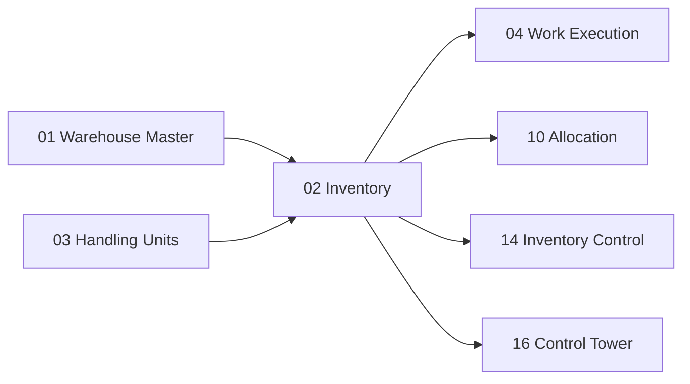

# Inventory Domain — Dominio de Inventario

> El inventario es la fuente de verdad del WMS. Odoo `stock.quant` sigue siendo el registro maestro; el WMS agrega estados operacionales, contexto de HU y un ledger de eventos para trazabilidad completa.

---

## Contexto

El inventario es el activo más protegido del sistema. Cada decisión que toma el WMS — desde dónde almacenar hasta qué recolectar — depende de datos de inventario precisos, actualizados y confiables. Un error en inventario se propaga a todos los procesos downstream.

---

## Propósito

1. Mantener una **fuente de verdad única** del inventario, basada en los modelos transaccionales de Odoo
2. **Extender** esa información con estados operacionales WMS que Odoo no maneja
3. Proveer un **Inventory Ledger** (libro de registro de inventario) que permita trazar la historia completa de cada unidad

---

## Diseño Funcional

### Fuente de Verdad: Modelos de Odoo

La fuente de verdad del inventario **continuará siendo Odoo**. No crearemos una segunda base de inventario.

| Modelo Odoo | En inglés | Qué representa |
|---|---|---|
| `stock.move` | Stock Move | Intención de mover inventario: un registro que dice "X unidades de producto Y deben ir de A a B" |
| `stock.move.line` | Stock Move Line | Detalle del move: lote específico, paquete, cantidad real |
| `stock.quant` | Stock Quant | **Inventario real**: cantidad de un producto en una ubicación específica, con lote y paquete. Es la foto actual del stock |

### Extensiones WMS

El WMS agregará capas de información que Odoo no contempla:

| Extensión | En inglés | Significado | Ejemplo |
|---|---|---|---|
| **Estado de Inventario** | Inventory Status | Estado operacional del stock más allá de "disponible" | `AVAILABLE`, `QUALITY_HOLD`, `QUARANTINE`, `DAMAGED`, `RESERVED`, `IN_TRANSIT` |
| **Propiedad del Inventario** | Inventory Ownership | A quién pertenece el inventario (permite operaciones 3PL) | `COMPANY-A`, `COMPANY-B` |
| **Contexto de Reserva** | Reservation Context | Para qué se reservó el inventario | `WAVE-105`, `ORDER-4892` |
| **Contexto de HU** | HU Context | En qué unidad de manejo está contenido | `PALLET-10092` |
| **Estado de Calidad** | Quality Status | Resultado de inspección de calidad | `PASSED`, `PENDING`, `REJECTED` |
| **Disponibilidad Operacional** | Operational Availability | Si está realmente disponible para operaciones WMS | Puede haber stock en sistema pero bloqueado por conteo |
| **Eventos de Inventario** | Inventory Events | Registro de cada acción que afectó este inventario | Ver Inventory Ledger abajo |

### Ejemplo de Registro Extendido

```text
SKU A
Warehouse SCL01
Location A03-R02-L04
Lot L00231
HU 780...                    ← SSCC del pallet
Owner COMPANY-A              ← Propiedad (3PL)
Status AVAILABLE             ← Estado operacional WMS
Qty 120                      ← Cantidad
```

Un `stock.quant` de Odoo solo conoce: product, location, lot, package, quantity. Nuestro WMS agrega: owner, status, HU context, reservation context y quality status.

---

## Inventory Ledger — Libro de Registro de Inventario

### ¿Qué es?

El **Inventory Ledger** (Libro de Registro de Inventario) es un modelo de eventos inmutables que registra cada acción que afecta al inventario. No pretende reemplazar `stock.move` de Odoo, sino proveer una capa de trazabilidad operacional adicional.

### Modelo Propuesto

```text
wms.inventory.event
```

### Ejemplo de Timeline

```text
12:04  RECEIVE       Supplier → RECEIVING         Recepción de proveedor
12:07  MOVE          RECEIVING → QUALITY           Movimiento a control de calidad
12:18  RELEASE       QUALITY → AVAILABLE           Liberación tras pasar QC
12:22  PUTAWAY       QUALITY → A03                 Almacenamiento en ubicación
16:42  PICK          A03 → CART-12                  Recolección a carro de picking
16:50  PACK          CART-12 → BOX-993             Empaque en caja
17:03  STAGE         BOX-993 → DOCK-04             Movimiento a staging
17:20  LOAD          DOCK-04 → TRUCK-21            Carga en camión
```

### Tipos de Evento

| Evento | En inglés | Significado |
|---|---|---|
| **Recibir** | RECEIVE | Mercadería ingresa al almacén desde origen externo |
| **Mover** | MOVE | Traslado entre ubicaciones internas |
| **Liberar** | RELEASE | Cambio de estado: bloqueado → disponible |
| **Almacenar** | PUTAWAY | Ubicación en posición de almacenamiento |
| **Recolectar** | PICK | Extracción de mercadería de una ubicación |
| **Empacar** | PACK | Mercadería colocada dentro de un empaque |
| **Preparar** | STAGE | Movimiento a área de staging pre-carga |
| **Cargar** | LOAD | Colocación en transporte |
| **Ajustar** | ADJUST | Corrección de cantidad por conteo o discrepancia |
| **Bloquear** | HOLD | Inventario retenido por calidad u otra razón |
| **Transferir** | TRANSFER | Movimiento entre bodegas |

### Propósitos del Ledger

| Propósito | Descripción |
|---|---|
| **Auditoría** | ¿Quién movió qué, cuándo y por qué? |
| **Troubleshooting** | ¿Dónde estuvo este pallet a las 14:00? |
| **Integración** | Alimentar eventos a sistemas externos (ERP, BI) |
| **Analytics** | Tiempos de permanencia, velocidad de rotación, cuellos de botella |
| **Reconstrucción operativa** | En caso de fallo, reconstruir el estado del inventario a un punto en el tiempo |

### Estructura del Evento

Cada evento contendrá:

| Campo | Significado |
|---|---|
| `timestamp` | Momento exacto de la acción |
| `event_type` | Tipo de evento (RECEIVE, PICK, etc.) |
| `product_id` | Producto afectado |
| `lot_id` | Lote o serial |
| `hu_id` | Unidad de manejo (Handling Unit) |
| `source_location` | Ubicación de origen |
| `dest_location` | Ubicación de destino |
| `quantity` | Cantidad |
| `operator_id` | Operador que ejecutó la acción |
| `device_id` | Dispositivo RF utilizado |
| `work_id` | Trabajo asociado |
| `correlation_id` | ID de correlación para agrupar eventos relacionados |
| `warehouse_id` | Bodega |

---

## Relación con Odoo

### Modelos Reutilizados

| Modelo | Qué reutilizamos |
|---|---|
| `stock.quant` | Inventario real — fuente de verdad |
| `stock.move` | Movimientos transaccionales de inventario |
| `stock.move.line` | Detalle de movimientos (lote, paquete, qty) |
| `stock.lot` | Lotes y números de serie |

### Modelos Extendidos

| Modelo | Extensión |
|---|---|
| `stock.quant` | Campos: `inventory_status`, `owner_id`, `quality_status`, `operational_availability` |

### Modelos Nuevos

| Modelo | Propósito |
|---|---|
| `wms.inventory.event` | Ledger de eventos de inventario |
| `wms.inventory.status` | Catálogo de estados operacionales |

---

## Concurrencia y Protección

El inventario es el dominio más expuesto a problemas de concurrencia. Múltiples operadores pueden estar intentando:

- Reservar el mismo stock para diferentes pedidos
- Confirmar picks que reducen la misma cantidad
- Ajustar inventario mientras se ejecuta un conteo

Las operaciones críticas sobre inventario usarán **locking explícito** en PostgreSQL (`SELECT ... FOR UPDATE`) para garantizar consistencia. Ver documento de [Concurrencia](../03-plataforma/06-disponibilidad.md) para más detalle.

---

## Dependencias



---

## Referencias

- Odoo 19 — Stock module: warehouses, moves, quants, lots, packages, storage categories, replenishment y trazabilidad (Community LGPL)

---

*Documento derivado de las secciones 5-6 del [Plan Maestro](../plan.md).*
