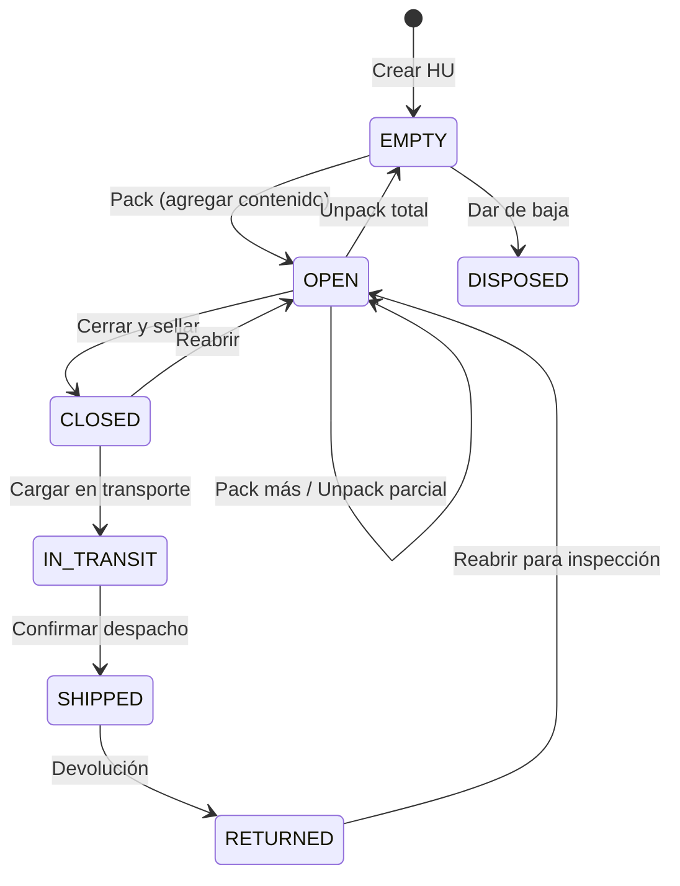
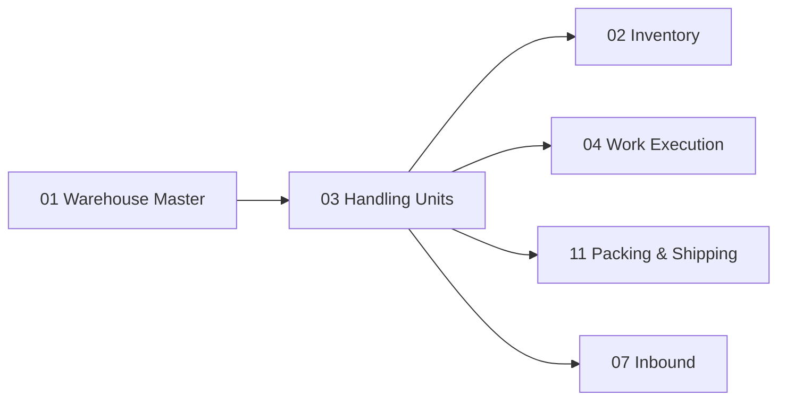

# Handling Units — Industrialización de `stock.package` (v1.2)

> Odoo 19 ya posee jerarquía de paquetes, dimensiones, SSCC y peso. No reconstruimos esa base. Industrializamos `stock.package` agregando semántica WMS: ciclo de vida, operaciones, clasificación operacional y trazabilidad.
>
> **v1.2**: Confirmado `stock.package` como nombre correcto (`_name = 'stock.package'` en Odoo 19). La clase Python es `StockPackage`.

---

## Contexto

### Cambios principales

La documentación v1.0 proponía construir HU "sobre el paquete básico de Odoo".

**Confirmación v1.2**:

1. El modelo real en Odoo 19 es **`stock.package`** (clase Python `StockPackage`, `_name = 'stock.package'`)
2. Odoo 19 ya posee **mucho más** de lo que documentábamos: jerarquía, dimensiones, peso, tipos de paquete con capacidades

> **ADR-013**: `stock.package` es la base de Handling Units. No crearemos un modelo de HU separado.

---

## Lo que Odoo 19 YA posee

### `stock.package`

| Campo | Significado | Ya existe |
|---|---|---|
| `name` | Referencia del paquete (puede ser SSCC) | ✅ |
| `package_type_id` | Tipo de paquete (dimensiones, peso, etc.) | ✅ |
| `parent_package_id` | Paquete padre (pack-in-pack) — jerarquía | ✅ |
| `child_package_ids` | Paquetes hijos (relación inversa) | ✅ |
| `location_id` | Ubicación actual del paquete | ✅ |
| `owner_id` | Propietario del paquete | ✅ |
| `shipping_weight` | Peso de envío real | ✅ |
| `pack_date` | Fecha de empaque | ✅ |
| `quant_ids` | Contenido: quants dentro del paquete | ✅ |
| `valid_sscc` | Validador algorítmico GS1 SSCC-18 sobre `name` | ✅ |

### `stock.package.type`

| Campo | Significado | Ya existe |
|---|---|---|
| `name` | Nombre del tipo (ej: "Euro Pallet") | ✅ |
| `height`, `width`, `packaging_length` | Dimensiones físicas | ✅ |
| `base_weight` | Peso tara (peso del contenedor vacío) | ✅ |
| `max_weight` | Peso máximo permitido | ✅ |
| `barcode` | Código de barras del tipo de paquete | ✅ |
| Storage capacities | Capacidades de almacenamiento por categoría | ✅ |

**Conclusión**: No necesitamos reconstruir jerarquía, dimensiones, tipo de paquete ni peso. Esto reduce significativamente el esfuerzo de la Fase HU.

---

## Lo que el WMS agrega

### Extensiones a `stock.package`

| Campo | En inglés | Estado | Significado |
|---|---|---|---|
| `hu_state` | HU State | ✅ HU-002 | Estado del ciclo de vida WMS: `EMPTY`, `OPEN`, `CLOSED`, `IN_TRANSIT`, `SHIPPED`, `RETURNED`, `DISPOSED` (False = no inicializado) |
| `hu_class` | HU Class | ✅ HU-002 | Clasificación operacional: `PALLET`, `CASE`, `TOTE`, `CONTAINER`, `MIXED` (False = no asignada) |
| `name` / `valid_sscc` | SSCC Reference | ✅ Odoo Nativo | Se reutiliza `stock.package.name` + `valid_sscc` nativos de Odoo 19; **no se crea un campo `sscc` duplicado** |
| `seal_number` | Seal Number | ⏸ Diferido | Número de sello de seguridad (para transporte) |
| `gtin` | GTIN | ⏸ Diferido | Global Trade Item Number del contenedor |
| `label_state` | Label State | ⏸ Diferido | Estado de la etiqueta GS1: `PENDING`, `PRINTED`, `APPLIED`, `DAMAGED` |
| `current_work_id` | Current Work | ⏸ Diferido | Work activo asociado a esta HU |
| `last_work_id` | Last Work | ⏸ Diferido | Último Work completado sobre esta HU |
| `weight_gross` | Gross Weight | ⏸ Diferido | Peso bruto real (tara + contenido, si se justifica frente a `shipping_weight`) |
| `weight_net` | Net Weight | ⏸ Diferido | Peso neto (solo contenido) |

> [!NOTE]
> `stock.package.history` ya existe en Odoo 19 nativo y se reutiliza para la trazabilidad de movimientos físicos de paquetes. Un futuro modelo `wms.hu.operation` sólo registrará operaciones de semántica WMS adicional (pack/unpack/split/merge).

### Ciclo de Vida de la HU



### Operaciones sobre HU

| Operación | En inglés | Significado | Implementación WMS |
|---|---|---|---|
| **Crear** | Create | Registrar una HU nueva en el sistema | `stock.package.create()` nativo Odoo |
| **Empacar** | Pack | Agregar contenido a la HU | `stock.package._wms_pack_physical()` (HU-004A, ADR-019) |
| **Desempacar** | Unpack | Retirar contenido de la HU | `stock.package.unpack()` nativo / `_wms_unpack_physical()` (HU-004B) |
| **Dividir** | Split | Dividir una HU transfiriendo stock a otra HU vacía | `stock.package._wms_split_physical()` (HU-004C, ADR-019) |
| **Consolidar** | Merge | Combinar contenido de dos HU en una | ⏸ Diferido |
| **Cerrar** | Close | Sellar, pesar, etiquetar | ⏸ Diferido |
| **Reabrir** | Reopen | Abrir HU sellada para inspección o corrección | ⏸ Diferido |
| **Mover** | Move | Mover la HU completa a otra ubicación | `stock.quant.move_quants()` nativo Odoo |
| **Disponer** | Dispose | Dar de baja la HU (destruir, reciclar) | ⏸ Diferido |

#### Empaque Físico Transaccional (`_wms_pack_physical` — HU-004A)

Physical Pack reutiliza el mecanismo nativo de direct quant relocation de Odoo 19 pinned, que materializa un `stock.move`/`stock.move.line` (`is_inventory=True`, `inventory_name="WMS Physical Pack"`) y ejecuta `_action_done()`, generando automáticamente el registro en `stock.package.history`.

Garantías del primitive:
- **Transición de ciclo de vida**: `EMPTY -> OPEN`, `OPEN -> OPEN`, adopción de paquete vacío (`False -> OPEN`).
- **Atomicidad ADR-019**: `stock.move` + `stock.quant` + `stock.package.history` + `wms.inventory.event` (PACK) + `wms.outbox` (`inventory.hu.packed`, schema v1) persisten de forma atómica en una única transacción PostgreSQL.
- **Frontera de privilegios (Narrow Sudo)**: Los guards operacionales, de compañía, de bloqueo (`wms.inventory.block`) y PLM (`wms.product.logistics`) ejecutan en el entorno del operador original. La mutación física y actualización de `hu_state` ejecutan bajo narrow sudo, preservando `event.operator_id` con la identidad real del operador.

#### Desempaque Físico Transaccional (`_wms_unpack_physical` — HU-004B)

Physical Unpack traslada contenido de la HU a inventario suelto (*loose stock*) en la misma ubicación física mediante `stock.move`/`stock.move.line` (`package_id=self`, `package_dest_id=False`, `is_inventory=True`, `inventory_name="WMS Physical Unpack"`) y `_action_done()`, seguido de `quant._quant_tasks()`.

Garantías del primitive:
- **Transición de ciclo de vida**: `OPEN -> OPEN` mientras la HU conserve quants (`contained_quant_ids`), y `OPEN -> EMPTY` cuando queda totalmente vacía.
- **Cero Historial de Paquete**: Al extraer a stock suelto (`result_package_id=False`), Odoo nativo no genera registros en `stock.package.history`.
- **Atomicidad ADR-019**: `stock.move` + `stock.quant` (cleanup) + `wms.inventory.event` (UNPACK) + `wms.outbox` (`inventory.hu.unpacked`, schema v1) persisten de forma atómica en la transacción PostgreSQL del llamador.
- **PLM de Admisión**: Las políticas de perfiles logísticos PLM (`allowed_hu_type_ids`) son reglas exclusivas de admisión/empaque y no bloquean el desempaque de stock existente.
- **Frontera de privilegios (Narrow Sudo)**: Los guards operacionales, de compañía y de bloqueo (`wms.inventory.block`) ejecutan en el entorno del operador original. La mutación física de stock y transición de `hu_state` ejecutan bajo narrow sudo, preservando `event.operator_id` con la identidad real del operador.

#### División Física Transaccional (`_wms_split_physical` — HU-004C)

Physical Split transfiere stock de una HU fuente en estado `OPEN` hacia una HU destino distinta, existente y físicamente vacía en estado `EMPTY` o sin inicializar (`False`), manteniendo ambas HUs en estado `OPEN` tras la mutación directa paquete a paquete vía `stock.move`/`stock.move.line` (`package_id=source`, `package_dest_id=destination`, `is_inventory=True`, `inventory_name="WMS Physical Split"`).

Garantías del primitive:
- **Preservación y Transición de Ciclo de Vida**: La fuente permanece `OPEN` y retiene contenido remanente (prohibido vaciado completo); el destino transiciona a `OPEN`.
- **Historial Nativo de Paquete**: Odoo genera automáticamente exactamente un registro en `stock.package.history` asociado a la HU destino.
- **Locking Pesimista Ordenado**: Bloqueo de ambos paquetes con `ORDER BY id FOR UPDATE` para evitar deadlocks ABBA.
- **Atomicidad ADR-019**: `stock.move` + `stock.quant` + `stock.package.history` (destino) + 2 `wms.inventory.event` (UNPACK/PACK) + 1 `wms.outbox` (`inventory.hu.split`, schema v1 con 10 claves canónicas) persisten de forma atómica.
- **PLM Destination Admission**: Restricciones de tipo de paquete evaluadas exclusivamente sobre el destino.
- **Frontera de Privilegios (Narrow Sudo)**: Guards y eventos operan bajo el usuario original (`operator_id` real); mutación de stock y actualización de `hu_state` bajo narrow sudo.

La trazabilidad de movimientos físicos de paquetes ya está cubierta de forma nativa por `stock.package.history` en Odoo 19. Para registrar eventos semánticos WMS adicionales (pack, unpack, split, merge), un futuro modelo `wms.hu.operation` (diferido) podrá capturar:

### HU Operation History (`wms.hu.operation` — ⏸ Diferido)

| Campo | Significado |
|---|---|
| `package_id` | HU afectada |
| `operation_type` | Tipo de operación |
| `operator_id` | Quién ejecutó |
| `device_id` | Desde qué dispositivo |
| `timestamp` | Cuándo |
| `work_id` | Work asociado |
| `details` | Detalles específicos (ej: qué quants se agregaron/removieron) |
| `correlation_id` | ID de correlación |

---

## SSCC — Serial Shipping Container Code

### ¿Qué es?

**SSCC** (Serial Shipping Container Code) es un identificador único global de 18 dígitos asignado a cada unidad logística (pallet, caja, contenedor) siguiendo el estándar GS1.

```text
(00) 1 7601234 000000001 2
 AI  E  GCP     Serial   Check
```

| Componente | Significado |
|---|---|
| AI `(00)` | Application Identifier: indica que es un SSCC |
| Extension digit | Dígito de extensión (aumenta capacidad de numeración) |
| GCP | Global Company Prefix (identificador de la empresa) |
| Serial | Número secuencial único |
| Check digit | Dígito verificador |

### Implementación

Odoo 19 tiene un campo `valid_sscc` que valida si `name` cumple el algoritmo checksum GS1 SSCC-18, y `name` se utiliza directamente como la referencia SSCC.

- **HU-003A**: Se implementa el modelo asignador `wms.sscc.sequence`, que configura y consume un contador transaccional `ir.sequence` estándar para producir identificadores SSCC-18 conformes a GS1 (`extension_digit (1) + GCP (4..12) + serial (12..4) + check_digit (1)`).
- **HU-003A.1**: Endurecimiento de unicidad global de base de datos (`UNIQUE(gs1_company_prefix, extension_digit)`).
- **HU-003B**: Asignación explícita e idempotente de identificadores SSCC a paquetes (`stock.package.assign_sscc(sscc_sequence_id)`), reemplazando el `name` genérico del paquete sin campos duplicados.
- **HU-003C1**: Reporte PDF Etiqueta Logística GS1 (SSCC-only en GS1-128 con FNC1, formato A6 105x148 mm).
- **HU-003C2**: Etiqueta Logística GS1 en formato ZPL para impresoras térmicas (diferido).
- **HU-003C3**: Políticas y auditoría de impresión/reimpresión (diferido).

---

## Relación con Odoo

### Modelos Reutilizados

| Modelo | Qué reutilizamos |
|---|---|
| `stock.package` | **Base completa** de HU: jerarquía, ubicación, propietario, contenido, referencia `name`, validación `valid_sscc` |
| `stock.package.type` | **Base completa** de tipo de paquete: dimensiones (`packaging_length`, `width`, `height`), peso, capacidades |
| `stock.package.history` | Historial nativo de movimientos y traslados físicos de paquetes |
| `ir.sequence` | Contador transaccional y atómico consumido por `wms.sscc.sequence` |
| `ir.actions.report` | Infraestructura de renderizado PDF y generador de códigos de barras ReportLab (`barcode()`) |

### Modelos Extendidos

| Modelo | Extensión |
|---|---|
| `stock.package` | **Implementados en HU-002**: `hu_state`, `hu_class`. **Implementado en HU-003B**: método `assign_sscc()`. **Diferidos**: `seal_number`, `gtin`, `label_state`, `current_work_id`, `last_work_id`, `weight_gross`, `weight_net`. (Nota: no se crea campo `sscc`; se reutiliza `name` + `valid_sscc`). |

### Modelos Nuevos

| Modelo | Estado | Propósito |
|---|---|---|
| `wms.sscc.sequence` | ✅ HU-003A / HU-003A.1 | Asignador de secuencias GS1 SSCC-18 con GCP configurable y contador `ir.sequence` |
| `report.wms_handling_unit.report_gs1_logistic_label` | ✅ HU-003C1 | Modelo técnico (AbstractModel) para validación de elegibilidad y renderizado de etiqueta GS1 |
| `wms.hu.operation` | ⏸ Diferido | Historial de operaciones semánticas WMS sobre HU (movimientos físicos cubiertos por `stock.package.history`) |

> **Nota**: Ya **no** se propone `wms.handling.unit` como modelo independiente. La HU ES `stock.package` extendido (ADR-013).

---

## Dependencias



---

*Documento corregido en v1.2. v1.0→v1.1: documentados campos existentes, eliminado modelo HU separado. v1.1→v1.2: confirmado `stock.package` como nombre correcto (ADR-013).*
