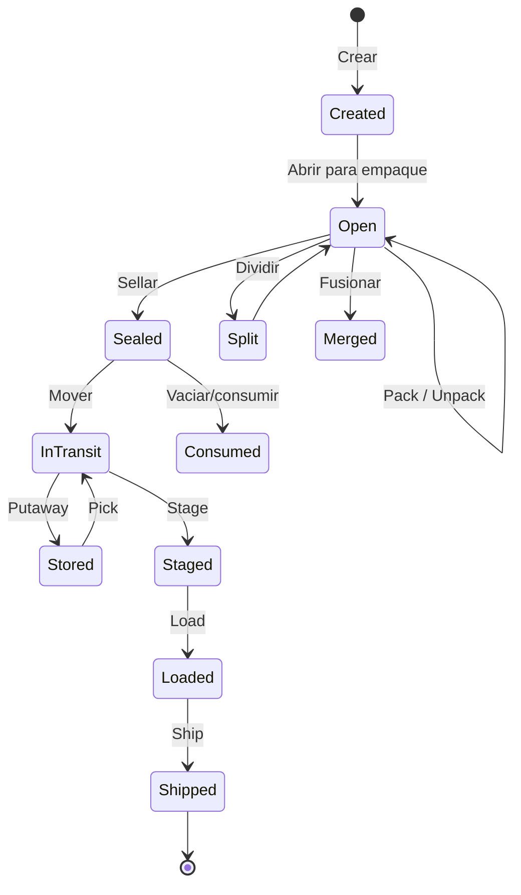
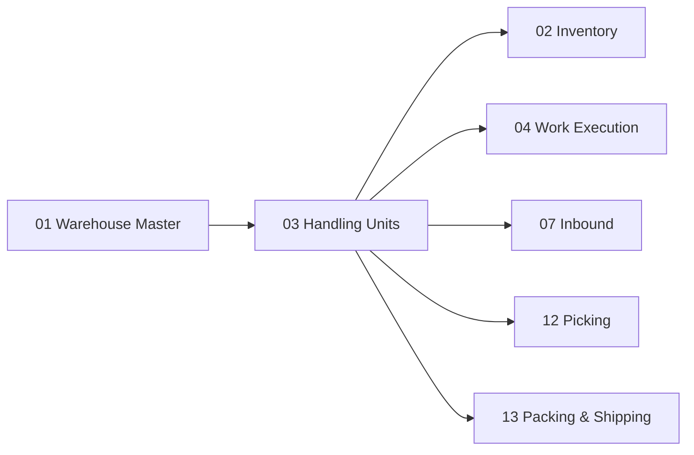

# Handling Units — Unidades de Manejo

> En un WMS industrial no se mueve solamente SKU. Se mueven pallets, cajas, contenedores y sus jerarquías. El HU Engine gestiona el ciclo de vida completo de las unidades de manejo.

---

## Contexto

### ¿Qué es una Handling Unit (HU)?

Una **Handling Unit** (HU) — en español, **Unidad de Manejo** — es cualquier objeto físico que contiene mercadería y se mueve como una unidad dentro del almacén. No es el producto en sí, sino el *contenedor* que lo transporta.

| Tipo de HU | En inglés | Descripción |
|---|---|---|
| **Pallet** | Pallet | Plataforma de madera o plástico, generalmente 1.2m × 1.0m, sobre la que se apilan cajas |
| **Caja** | Case/Carton | Caja de cartón o plástico que contiene unidades del producto |
| **Tote** | Tote | Contenedor reutilizable plástico, usado en picking de piezas pequeñas |
| **Bin** | Bin | Caja pequeña para almacenamiento de componentes |
| **Contenedor** | Container | Contenedor grande para transporte o almacenamiento a granel |
| **Paquete** | Parcel | Paquete individual preparado para envío |

---

## Propósito

Modelar las unidades de manejo con semántica logística completa:

1. **Identificación única** de cada HU a lo largo de toda la cadena (SSCC)
2. **Jerarquía de empaque**: un pallet contiene cajas, una caja contiene unidades
3. **Operaciones físicas**: crear, empacar, desempacar, dividir, fusionar, mover, despachar
4. **Trazabilidad**: saber en todo momento dónde está cada HU y qué contiene

---

## Diseño Funcional

### Identificación: SSCC

Cada HU se identifica mediante un **SSCC (Serial Shipping Container Code)** — en español, **Código de Contenedor de Envío Serial**. Es un estándar definido por GS1 que asigna un número único global de 18 dígitos a cada unidad logística.

El SSCC permite que cualquier participante de la cadena de suministro identifique inequívocamente un pallet o caja mediante el escaneo de un código de barras.

### Jerarquía de Empaque

Las HUs pueden anidarse. Un pallet puede contener cajas, y una caja puede contener productos de distintos SKUs:

```text
PALLET (SSCC: 780...)
  │
  ├ BOX (SSCC: 780...01)
  │ └ SKU-A × 24
  │
  ├ BOX (SSCC: 780...02)
  │ └ SKU-A × 24
  │
  └ BOX (SSCC: 780...03)
    ├ SKU-B × 10
    └ SKU-C × 6
```

### Operaciones sobre HU

| Operación | En inglés | Significado |
|---|---|---|
| **Crear** | Create | Dar de alta una nueva HU vacía o con contenido |
| **Empacar** | Pack | Agregar producto o una HU hija dentro de una HU padre |
| **Desempacar** | Unpack | Extraer producto o una HU hija de una HU padre |
| **Dividir** | Split | Separar parte del contenido de una HU en una nueva HU |
| **Fusionar** | Merge | Combinar el contenido de dos o más HUs en una sola |
| **Anidar** | Nest | Colocar una HU dentro de otra (ej: cajas en pallet) |
| **Desanidar** | Unnest | Sacar una HU hija de su HU padre |
| **Sellar** | Seal | Cerrar la HU y marcarla como completa |
| **Mover** | Move | Trasladar la HU de una ubicación a otra |
| **Re-etiquetar** | Relabel | Cambiar o actualizar la etiqueta/SSCC de la HU |
| **Consumir** | Consume | Marcar la HU como utilizada/vaciada |
| **Despachar** | Ship | Enviar la HU fuera del almacén |

### Ciclo de Vida



---

## Modelo de Datos

### Atributos de una HU

| Campo | Tipo | Significado |
|---|---|---|
| `sscc` | String (18) | Código SSCC único global |
| `hu_type` | Selection | Tipo: PALLET, CASE, TOTE, BIN, CONTAINER, PARCEL |
| `parent_id` | Many2one | HU padre (para jerarquía) |
| `state` | Selection | Estado del ciclo de vida |
| `location_id` | Many2one | Ubicación actual en el almacén |
| `weight_gross` | Float | Peso bruto (contenido + empaque) |
| `weight_net` | Float | Peso neto (solo contenido) |
| `height` | Float | Altura |
| `width` | Float | Ancho |
| `length` | Float | Largo |
| `volume` | Float | Volumen calculado |
| `seal_number` | String | Número de sello de seguridad |
| `label_printed` | Boolean | Si la etiqueta fue impresa |

---

## Relación con Odoo

### Modelos Reutilizados

| Modelo | Qué aporta |
|---|---|
| `stock.quant.package` | Concepto base de "paquete" en Odoo — ya maneja jerarquía padre-hijo |

### Modelos Extendidos

| Modelo | Extensión |
|---|---|
| `stock.quant.package` | Agregar: `sscc`, `hu_type`, `state`, dimensiones, peso, `seal_number` |

### Modelos Nuevos

| Modelo | Propósito |
|---|---|
| `wms.hu.type` | Catálogo de tipos de HU con dimensiones y pesos estándar |
| `wms.hu.operation` | Registro de operaciones sobre HUs (pack, unpack, split, merge, etc.) |

---

## Dependencias



---

## Referencias

- [GS1 — SSCC / Logistic Label Guideline](https://www.gs1.org/standards/gs1-logistic-label-guideline/current-standard)

---

*Documento derivado de la sección 7 del [Plan Maestro](../plan.md).*
