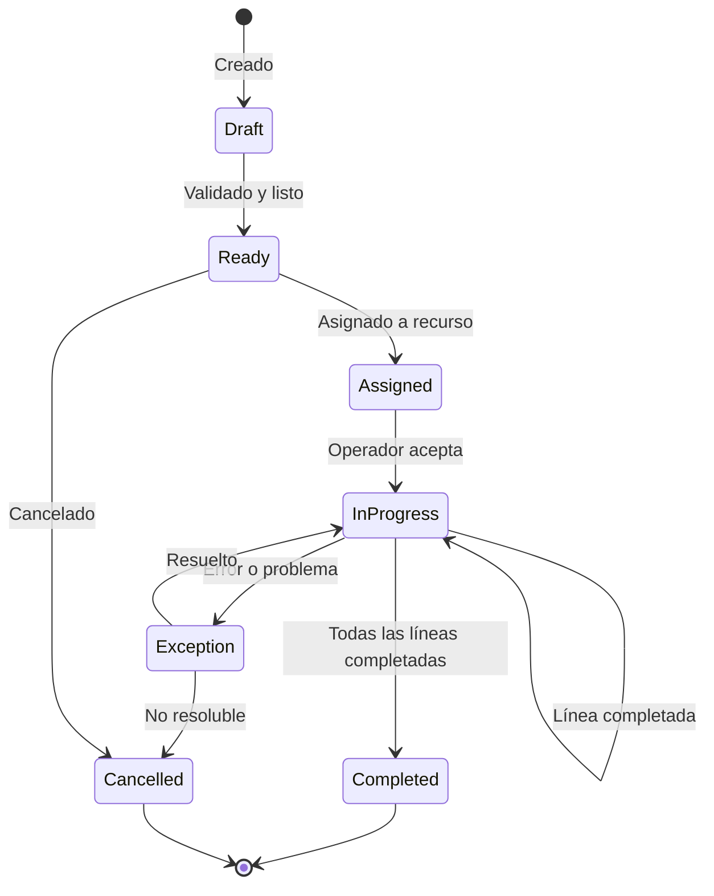
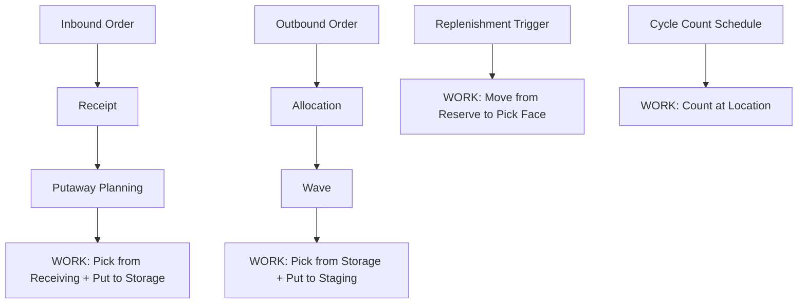
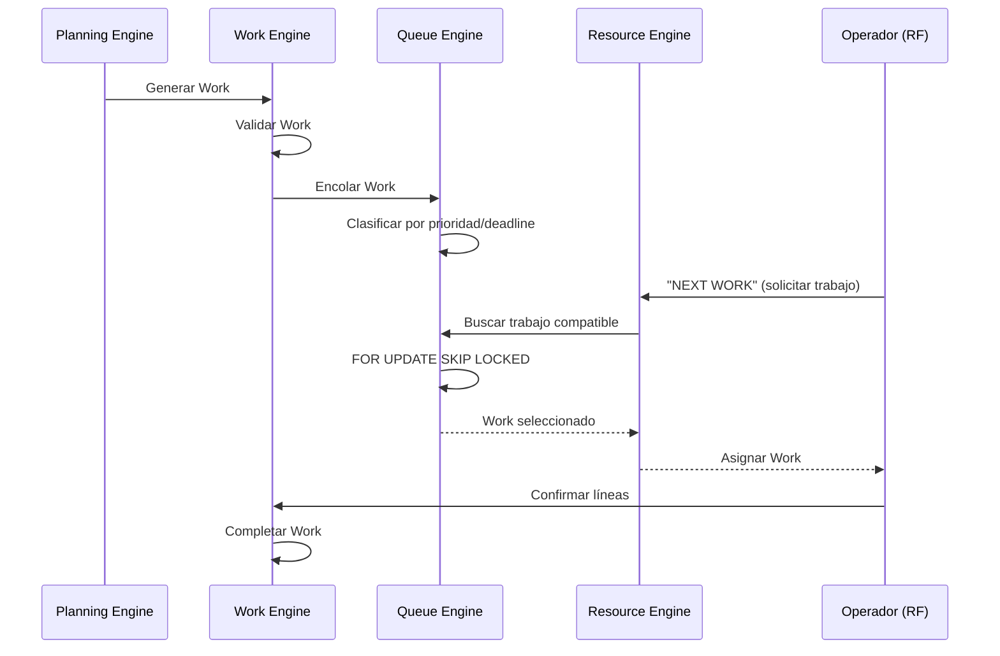
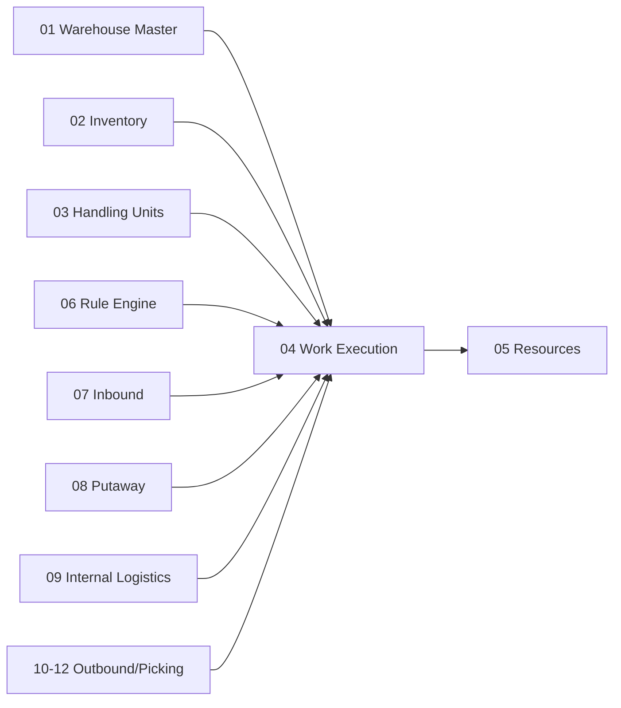

# Work Execution — Motor de Trabajo y Motor de Colas

> El componente más importante de toda la plataforma. Transforma necesidades logísticas en unidades de trabajo ejecutables y las distribuye a través de colas a los recursos disponibles.

---

## Contexto

### ¿Qué es "trabajo dirigido" (Directed Work)?

En Odoo estándar, un operador abre una pantalla, ve una lista de pickings y elige uno. En un WMS industrial, el operador **no elige**: el sistema le **asigna** trabajo optimizado.

**Trabajo dirigido** (*Directed Work*) significa que el WMS:
1. Determina *qué* hay que hacer (Work Generation)
2. Organiza *cómo* distribuirlo (Queue Engine)
3. Decide *a quién* asignarlo (Assignment Engine)
4. Dirige *paso a paso* la ejecución (RF)

### ¿Por qué es el componente más importante?

Porque **todo flujo operacional** — inbound, putaway, picking, replenishment, counting, packing — se ejecuta a través de Work. Si el Work Engine no funciona correctamente, nada funciona.

---

## Propósito

> Transformar necesidades logísticas en unidades de trabajo ejecutables, organizarlas en colas y distribuirlas a recursos compatibles con alta concurrencia.

---

## Diseño Funcional del Work Engine

### ¿Qué es un Work?

Un **Work** (`wms.work`) es la unidad fundamental de ejecución del WMS. Contiene una o más líneas que indican al operador exactamente qué hacer:

```text
Work 10592

Priority 80

Line 10
  PICK                           ← Acción: recoger
  RECEIVING-04                   ← Desde: ubicación de recepción 04
  PALLET 10092                   ← Objeto: pallet con SSCC 10092

Line 20
  PUT                            ← Acción: colocar
  A04-R02-L03                    ← En: pasillo A04, rack 02, nivel 03
```

### Tipos de Work

| Tipo | En inglés | Significado | Ejemplo |
|---|---|---|---|
| **Recolección** | Pick | Extraer mercadería de una ubicación | Picking de pedido de cliente |
| **Colocación** | Put | Depositar mercadería en una ubicación | Putaway tras recepción |
| **Movimiento** | Move | Trasladar de una ubicación a otra | Reubicación interna |
| **Conteo** | Count | Contar inventario en una ubicación | Conteo cíclico |
| **Reposición** | Replenishment | Reponer una ubicación de picking | Pick face vacío |
| **Carga** | Load | Cargar mercadería en un transporte | Loading en dock |
| **Inspección** | Inspect | Verificar mercadería | Control de calidad |
| **Empaque** | Pack | Empacar mercadería | Estación de packing |

### Modelos Propuestos

| Modelo | En inglés | Propósito |
|---|---|---|
| `wms.work` | Work | Registro de trabajo con estado, prioridad, tipo, recurso asignado |
| `wms.work.line` | Work Line | Cada paso del trabajo: acción (PICK/PUT), ubicación, producto, cantidad |
| `wms.work_type` | Work Type | Catálogo de tipos de trabajo (pick, put, move, count...) |
| `wms.work_class` | Work Class | Clasificación para agrupación y priorización (ej: "putaway-forklift", "pick-manual") |
| `wms.work_template` | Work Template | Plantilla configurable que define cómo generar trabajo para cada escenario |
| `wms.work_dependency` | Work Dependency | Relaciones de precedencia: "Work B no puede empezar hasta que Work A termine" |
| `wms.work_exception` | Work Exception | Registro de excepciones ocurridas durante la ejecución |

### Máquina de Estados del Work



| Estado | En inglés | Significado |
|---|---|---|
| **Borrador** | Draft | Creado pero no validado |
| **Listo** | Ready | Validado, esperando asignación |
| **Asignado** | Assigned | Asignado a un recurso específico |
| **En Progreso** | In Progress | El operador está ejecutando las líneas |
| **Completado** | Completed | Todas las líneas ejecutadas exitosamente |
| **Excepción** | Exception | Un problema detuvo la ejecución |
| **Cancelado** | Cancelled | Trabajo cancelado |

### Generación de Work

El Work no se crea manualmente. Se genera automáticamente cuando un motor de planificación lo solicita:



### Diferencia clave: `stock.picking` ≠ `wms.work`

| Concepto | `stock.picking` (Odoo) | `wms.work` (WMS) |
|---|---|---|
| **Nivel** | Registro logístico (Nivel A) | Ejecución física (Nivel C) |
| **Propósito** | Agrupar movimientos de inventario | Dirigir un operador paso a paso |
| **Quién lo usa** | Backoffice, ERP | Operador con RF en piso |
| **Granularidad** | Puede tener muchas líneas de distintas ubicaciones | Optimizado para un recorrido específico |
| **Estado** | Depende de confirmación manual | Controlado por el motor de ejecución |

---

## Diseño Funcional del Queue Engine — Motor de Colas

### ¿Qué es una Queue?

Una **Queue** (Cola) es una estructura que organiza trabajos pendientes y los filtra para distribuir solo a recursos compatibles. Work y Queue son conceptos **distintos**:

| Concepto | Pregunta que responde |
|---|---|
| **Work** | ¿Qué hay que hacer? |
| **Queue** | ¿Quién puede tomarlo? |

### Ejemplo

Una cola llamada `QUEUE-PUTAWAY-FORKLIFT-A` podría aceptar solamente trabajo que cumpla:

```text
Zone = A                         ← Solo zona A
Equipment = Forklift             ← Requiere montacarga
Certification = HighRack         ← Operador certificado para rack alto
Weight <= 1200kg                 ← Peso máximo del pallet
```

### Atributos de una Queue

| Atributo | En inglés | Significado |
|---|---|---|
| **Prioridad** | Priority | Orden de importancia de la cola |
| **Área de actividad** | Activity Area | Zona del almacén que atiende |
| **Perfil de recurso** | Resource Profile | Qué tipo de recurso puede atender esta cola |
| **Requerimiento de equipo** | Equipment Requirement | Qué equipamiento se necesita |
| **Tipo de trabajo** | Work Type | Qué tipos de trabajo acepta (pick, put, move...) |
| **Bodega** | Warehouse | En qué bodega opera |
| **Zona** | Zone | Zona específica |
| **Fecha límite** | Deadline | Hora máxima para completar el trabajo |
| **Cutoff** | Cutoff | Hora de corte operacional (ej: "todo lo de la wave de las 16:00") |

### Flujo Work → Queue → Resource



---

## Concurrencia: El Desafío Central

### El Problema

En un almacén industrial puede haber:

```text
250 dispositivos RF simultáneos

50 → Picking
35 → Putaway
20 → Replenishment
10 → Conteos
40 → Packing
...
```

Todos solicitando trabajo al mismo tiempo. Si dos operadores reciben el mismo trabajo, se produce una **doble asignación** que corrompe el inventario.

### La Solución: `FOR UPDATE SKIP LOCKED`

PostgreSQL provee un mecanismo específico para este patrón — múltiples consumidores de una cola:

```sql
SELECT id
FROM wms_work
WHERE state = 'ready'
  AND queue_id = %s
ORDER BY priority DESC, deadline ASC
FOR UPDATE SKIP LOCKED
LIMIT 1;
```

| Cláusula | Significado |
|---|---|
| `FOR UPDATE` | Bloquea la fila seleccionada para que nadie más la tome |
| `SKIP LOCKED` | Si la fila ya está bloqueada por otra transacción, la salta y toma la siguiente |

Resultado:

```text
Operador A → Work 10    (Work 10 bloqueado)
Operador B → Work 11    (Work 10 saltado, toma Work 11)
Operador C → Work 12    (Work 10 y 11 saltados, toma Work 12)
```

**Sin espera entre operadores. Sin duplicación de asignaciones.**

### Garantías de Concurrencia

| Garantía | Cómo se logra |
|---|---|
| No hay doble asignación | `FOR UPDATE SKIP LOCKED` |
| No hay espera entre operadores | `SKIP LOCKED` salta filas bloqueadas |
| Consistencia transaccional | PostgreSQL ACID |
| Recuperación ante crash | Si un operador se desconecta, la transacción se revierte y el Work vuelve a `ready` |

---

## Dependencias



**El Work Execution Engine es el nexo central del sistema.** Recibe solicitudes de generación de trabajo de todos los dominios de planificación y distribuye el trabajo a los recursos.

---

## Referencias

- [SAP EWM — Warehouse Order](https://help.sap.com/docs/SAP_SUPPLY_CHAIN_MANAGEMENT/dc8e3ce481cc493aad2145b99e6c53eb/3d267d0c-463f-4bf5-b2b9-a72eac15dccc.html)
- [SAP — Queue Assignment](https://help.sap.com/docs/SAP_S4HANA_ON-PREMISE/9832125c23154a179bfa1784cdc9577a/6ccdcb53ad377114e10000000a174cb4.html)
- [PostgreSQL — SELECT ... FOR UPDATE SKIP LOCKED](https://www.postgresql.org/docs/current/sql-select.html)

---

*Documento derivado de las secciones 8-9 y 12 del [Plan Maestro](../plan.md).*
