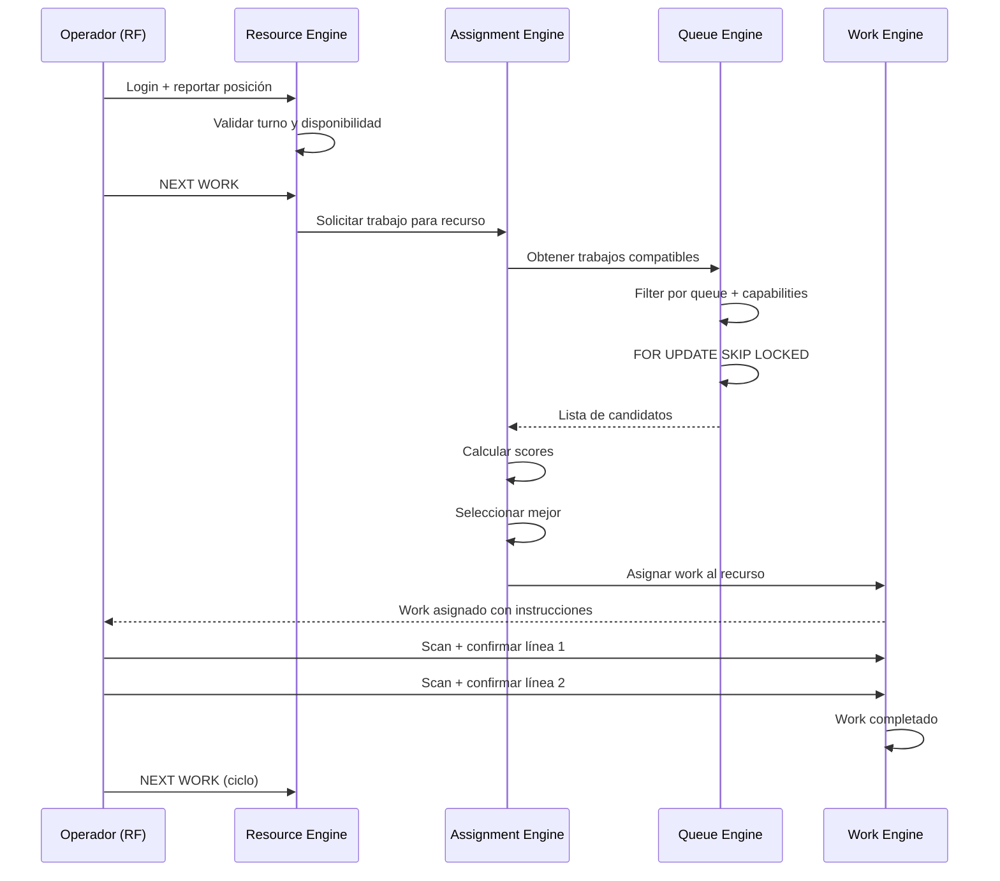
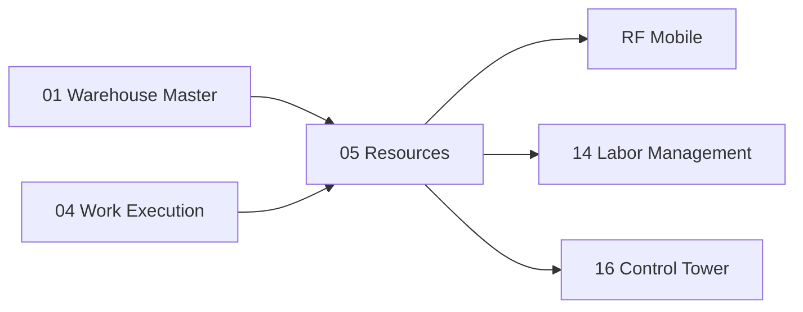

# Resources — Recursos, Operadores, Equipos y Asignación

> El WMS no modela al operario simplemente como un usuario. Crea una entidad completa que representa recursos humanos y mecánicos con capacidades, certificaciones y disponibilidad.

---

## Contexto

### ¿Por qué no basta con `res.users`?

En Odoo estándar, un operador es simplemente un usuario (`res.users`) con permisos. No tiene:
- Zona de trabajo asignada
- Certificaciones (ej: montacarga, rack alto, materiales peligrosos)
- Equipo asignado
- Posición actual en el almacén
- Turno y disponibilidad
- Cola de trabajo compatible

Un WMS industrial necesita una representación completa del **recurso** (humano o mecánico) para decidir inteligentemente qué trabajo asignarle.

---

## Propósito

1. Modelar operadores y equipos como **recursos** con capacidades específicas
2. Determinar compatibilidad entre recursos y colas de trabajo
3. Implementar un **Assignment Engine** (motor de asignación) que seleccione el trabajo óptimo para cada recurso

---

## Diseño Funcional del Resource Engine

### ¿Qué es un Resource?

Un **Resource** (`wms.resource`) es cualquier entidad capaz de ejecutar trabajo en el almacén:

| Tipo | En inglés | Descripción |
|---|---|---|
| **Operador** | Operator | Persona que trabaja en el piso del almacén |
| **Montacarga** | Forklift | Vehículo motorizado para levantar y mover pallets pesados |
| **Reach Truck** | Reach Truck | Montacarga con brazo extensible para racks de gran altura |
| **Transpaleta** | Pallet Jack | Herramienta manual o eléctrica para mover pallets a nivel de piso |
| **Robot** | Robot | Sistema automatizado de manipulación |
| **AGV** | Automated Guided Vehicle | Vehículo de guía automática que sigue rutas predefinidas |
| **AMR** | Autonomous Mobile Robot | Robot móvil autónomo que navega dinámicamente |
| **Estación de Picking** | Picking Station | Puesto fijo donde un operador procesa mercadería (goods-to-person) |

### Capacidades del Resource

| Capacidad | En inglés | Significado | Ejemplo |
|---|---|---|---|
| **Bodega** | Warehouse | En qué bodega trabaja | SCL01 |
| **Zonas** | Zones | En qué zonas puede operar | Zona A, Zona B |
| **Certificaciones** | Certifications | Habilitaciones formales | Montacarga, Rack alto, HAZMAT |
| **Clases de trabajo** | Work Classes | Qué tipos de trabajo puede ejecutar | Pick manual, Putaway forklift |
| **Capacidad de peso** | Weight Capability | Peso máximo que puede manejar | 2,000 kg |
| **Tipo de equipo** | Equipment Type | Categoría de equipo | Forklift, Pallet jack, Manual |
| **Posición actual** | Current Position | Última ubicación registrada | A03-R02 |
| **Cola actual** | Current Queue | Cola de trabajo a la que está suscrito | QUEUE-PICK-ZONE-A |
| **Disponibilidad** | Availability | Si está activo, en pausa, desconectado | Active, Break, Offline |
| **Turno** | Shift | Horario de trabajo asignado | 06:00–14:00 |

### Modelo de Datos

| Modelo | Propósito |
|---|---|
| `wms.resource` | Recurso (operador o equipo) con capacidades |
| `wms.resource.type` | Catálogo de tipos de recurso |
| `wms.certification` | Certificaciones disponibles |
| `wms.resource.certification` | Relación recurso-certificación |
| `wms.shift` | Definición de turnos |

---

## Diseño Funcional del Assignment Engine — Motor de Asignación

### ¿Qué hace?

Cuando un operador solicita trabajo (presiona "NEXT WORK" en su RF), el Assignment Engine **no devuelve simplemente el primer registro** de la cola. Evalúa múltiples factores para seleccionar el trabajo **óptimo** para ese recurso en ese momento.

### Factores de Evaluación

| Factor | En inglés | Significado | Peso |
|---|---|---|---|
| **Prioridad** | Priority | Prioridad del trabajo | Alto |
| **Fecha límite** | Deadline | Hora máxima para completar | Alto |
| **Cola** | Queue | Cola de origen del trabajo | Medio |
| **Zona** | Zone | Zona del trabajo vs. zona del recurso | Medio |
| **Distancia** | Distance | Qué tan lejos está el trabajo del recurso | Medio |
| **Equipo** | Equipment | Si el recurso tiene el equipo necesario | Obligatorio |
| **Capacidad** | Capability | Si el recurso tiene las certificaciones requeridas | Obligatorio |
| **Posición actual** | Current Location | Ubicación actual del operador | Medio |
| **Antigüedad del trabajo** | Work Aging | Cuánto tiempo lleva el trabajo esperando | Alto |
| **Prioridad de wave** | Wave Priority | Prioridad de la wave a la que pertenece | Medio |
| **Ruta** | Route | Optimización de recorrido | Bajo |

### Fórmula de Scoring

Conceptualmente, cada trabajo candidato recibe un **score** (puntaje):

```text
score =
 + priority             ← Prioridad del trabajo (0-100)
 + urgency              ← Cercanía al deadline
 + proximity            ← Cercanía física al recurso
 + affinity             ← Afinidad zona-recurso
 + queue_priority        ← Prioridad de la cola
 - travel_cost           ← Costo de desplazamiento
```

El trabajo con **mayor score** se asigna al recurso.

### Ejemplo de Decisión

```text
Operador: Juan
Posición: Zona A, Pasillo 03
Equipo: Transpaleta manual
Certificaciones: Pick manual, Zone A, Zone B

Trabajo candidato 1:
  Pick en Zone A, Pasillo 02
  Priority 80, Deadline 16:00
  Score: 92

Trabajo candidato 2:
  Pick en Zone B, Pasillo 15
  Priority 90, Deadline 16:30
  Score: 85  (penalizado por distancia)

Trabajo candidato 3:
  Putaway con Forklift
  Score: 0   (recurso no tiene equipo compatible → descartado)

→ Se asigna Trabajo 1 a Juan
```

### Evolución del Motor

| Fase | Enfoque |
|---|---|
| **Inicial** | Score basado en reglas fijas con pesos configurables |
| **Intermedia** | Optimización con restricciones (solver) |
| **Avanzada** | Machine learning para ajuste dinámico de pesos |

La evolución puede ocurrir **sin cambiar el modelo operacional** — solo cambia cómo se calcula el score.

---

## Flujo Completo: Request → Assignment → Execution



---

## Dependencias



---

## Referencias

- [SAP EWM — Queue / Resource Assignment](https://help.sap.com/docs/SAP_S4HANA_ON-PREMISE/9832125c23154a179bfa1784cdc9577a/6ccdcb53ad377114e10000000a174cb4.html)

---

*Documento derivado de las secciones 10-11 del [Plan Maestro](../plan.md).*
