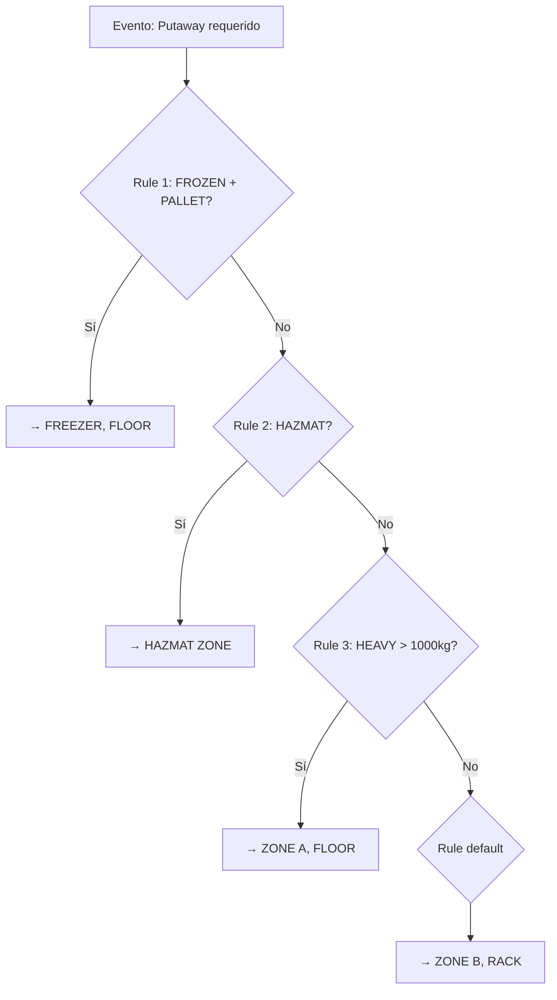
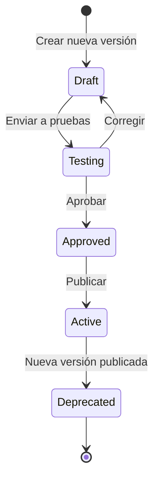
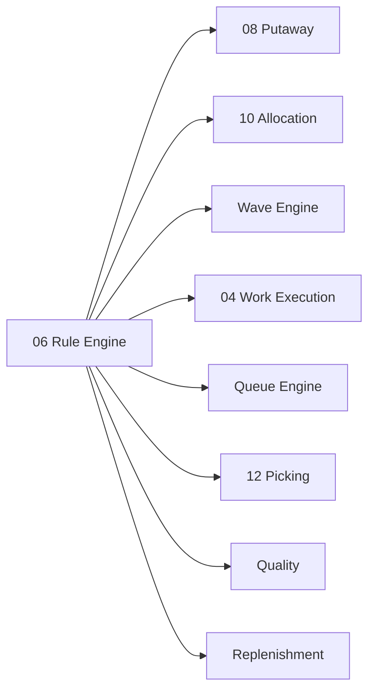

# Rule Engine — Motor de Reglas Configurables

> Políticas configurables y declarativas que controlan el comportamiento del WMS sin escribir código. Versionadas, auditables, testeables y simulables.

---

## Contexto

### El Problema

Sin un motor de reglas, un WMS termina con cientos de condiciones hardcodeadas:

```python
if warehouse == 'SCL01':
    if product.category == 'FROZEN':
        if hu_type == 'PALLET':
            zone = 'FREEZER'
```

Este enfoque es:
- **Frágil**: cada cambio de negocio requiere modificación de código
- **Opaco**: el equipo de operaciones no puede ver ni entender las reglas
- **No testeable**: imposible simular el impacto de un cambio antes de aplicarlo
- **No auditable**: no hay registro de cuándo cambió una regla ni quién la cambió

### La Solución

Un **Rule Engine** (Motor de Reglas) que permite definir el comportamiento del WMS de forma **declarativa** — es decir, describiendo *qué* debe suceder bajo qué condiciones, en lugar de programar *cómo*.

---

## Propósito

Crear un sistema de reglas que:
1. Sea **configurable** desde la interfaz administrativa sin tocar código
2. Sea **declarativo**: condiciones y acciones claras
3. Sea **versionado**: cada cambio queda registrado
4. Sea **simulable**: poder probar el impacto antes de activar

---

## Diseño Funcional

### Modelos Propuestos

| Modelo | En inglés | Propósito |
|---|---|---|
| `wms.rule` | Rule | Regla individual con nombre, dominio de aplicación y prioridad |
| `wms.rule_condition` | Rule Condition | Cada condición que debe cumplirse (IF) |
| `wms.rule_action` | Rule Action | Cada acción que se ejecuta cuando se cumplen las condiciones (THEN) |
| `wms.rule_set` | Rule Set | Agrupación de reglas para un dominio específico |
| `wms.rule_version` | Rule Version | Versión específica de un conjunto de reglas con fecha de activación |

### Dominios de Aplicación

Las reglas son transversales — se aplican a múltiples procesos del WMS:

| Dominio | En inglés | Ejemplo de regla |
|---|---|---|
| **Almacenamiento** | Putaway | "Si temperatura=FROZEN y HU=PALLET, entonces zona=FREEZER" |
| **Asignación** | Allocation | "Si cliente=PREMIUM, entonces FEFO y full pallet primero" |
| **Reposición** | Replenishment | "Si pick_face < min, entonces reponer hasta max" |
| **Olas** | Wave | "Agrupar por carrier + zona, cutoff 16:00" |
| **Trabajo** | Work | "Pick manual < 20kg, forklift >= 20kg" |
| **Colas** | Queue | "Cola HAZMAT requiere certificación clase 3" |
| **Picking** | Picking | "Zona A = batch picking, Zona B = zone picking" |
| **Empaque** | Packing | "Si frágil, agregar protección" |
| **Calidad** | Quality | "Si proveedor nuevo, inspección 100%" |
| **Despacho** | Shipping | "Si peso > 30kg, requiere dos operadores para carga" |

### Estructura de una Regla

```text
RULE PUTAWAY_FROZEN               ← Nombre descriptivo

DOMAIN: Putaway                   ← A qué proceso aplica
PRIORITY: 10                      ← Orden de evaluación (menor = primero)
ACTIVE: true                      ← Si está activa
VERSION: 3                        ← Versión actual

IF
  temperature_class = FROZEN      ← Condición 1
  AND
  HU_TYPE = PALLET                ← Condición 2

THEN
  zone = FREEZER                  ← Acción: asignar a zona congelados
  storage_type = FLOOR            ← Acción: almacenamiento a piso
```

### Evaluación de Reglas

Las reglas se evalúan en orden de prioridad. La primera regla cuyas condiciones se cumplan, se ejecuta:



### Propiedades de las Reglas

Las reglas deben ser:

| Propiedad | En inglés | Significado |
|---|---|---|
| **Versionadas** | Versioned | Cada cambio crea una nueva versión, las anteriores quedan como historial |
| **Auditables** | Auditable | Se registra quién creó/modificó cada regla y cuándo |
| **Testeables** | Testable | Se pueden ejecutar contra datos de prueba para verificar el comportamiento |
| **Simulables** | Simulable | Se puede simular el impacto de una nueva versión antes de activarla |
| **Publicables** | Publishable | Se activan explícitamente, no automáticamente al guardar |

### Ciclo de Vida de una Versión de Reglas



---

## Relación con Odoo

### Modelos Nuevos

Todos los modelos del Rule Engine son nuevos — Odoo no tiene un motor de reglas declarativas:

| Modelo | Propósito |
|---|---|
| `wms.rule` | Regla con condiciones y acciones |
| `wms.rule_condition` | Condiciones (campo, operador, valor) |
| `wms.rule_action` | Acciones (campo destino, valor) |
| `wms.rule_set` | Conjunto de reglas para un dominio |
| `wms.rule_version` | Versionamiento de conjuntos de reglas |

---

## Dependencias



El Rule Engine **no tiene dependencias funcionales** con otros dominios WMS (es autocontenido), pero prácticamente todos los dominios **consumen** reglas.

---

*Documento derivado de la sección 13 del [Plan Maestro](../plan.md).*
