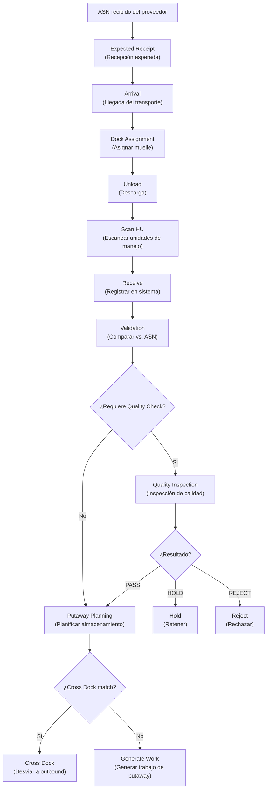
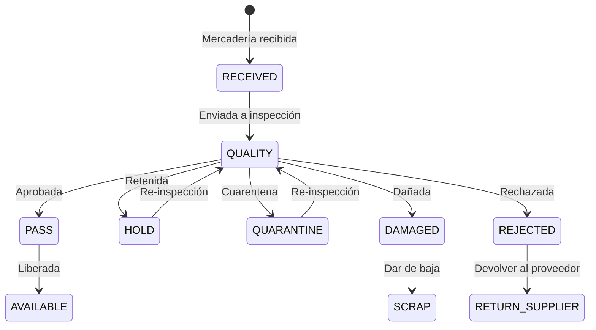
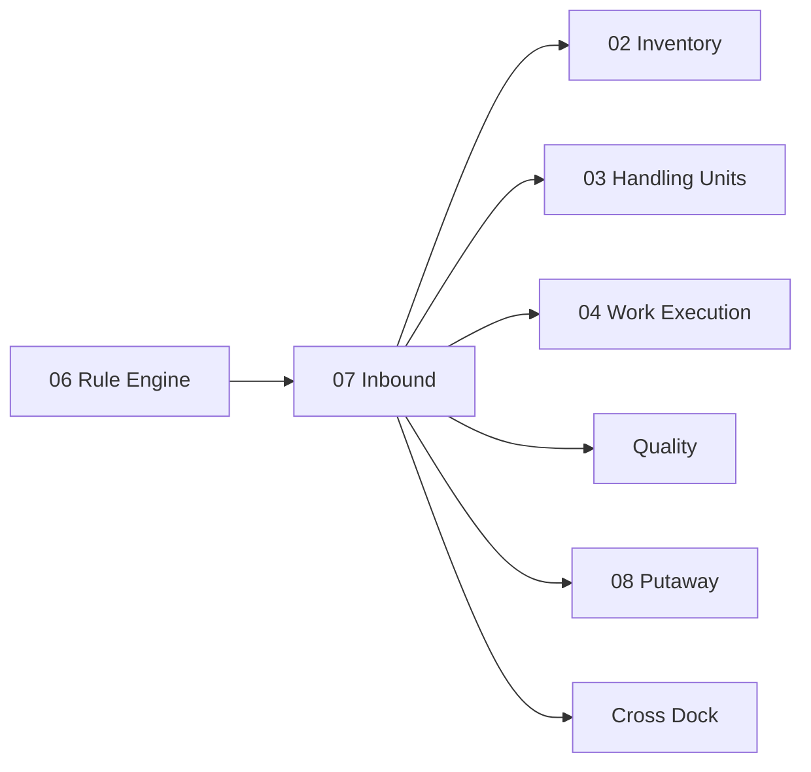

# Inbound — Recepción, Dock/Yard y Calidad

> El flujo completo desde que un camión llega a la bodega hasta que la mercadería está verificada, aprobada en calidad y lista para almacenamiento.

---

## Contexto

El proceso de **Inbound** (Entrada) es la puerta de ingreso del almacén. Todo lo que entre al inventario pasa por aquí. Un proceso de inbound mal diseñado genera:
- Retrasos en disponibilidad de inventario
- Discrepancias entre lo esperado y lo recibido
- Cuellos de botella en docks y zonas de recepción
- Problemas de calidad no detectados a tiempo

---

## Propósito

Gestionar el flujo completo de ingreso de mercadería:

1. Anticipar qué viene (**ASN**)
2. Coordinar la llegada (**Appointment / Dock**)
3. Controlar la descarga (**Unload**)
4. Verificar lo recibido (**Receiving / Verification**)
5. Gestionar discrepancias (**Discrepancies**)
6. Controlar calidad (**Quality**)
7. Generar el trabajo de almacenamiento (**Putaway Planning → Work**)

---

## Diseño Funcional del Inbound

### Entidades del Dominio

| Entidad | En inglés | Significado |
|---|---|---|
| **ASN** | Advanced Shipping Notice | Aviso anticipado de envío: documento electrónico del proveedor que detalla qué mercadería viene, en qué cantidades, con qué lotes, en qué HUs y cuándo llegará |
| **Cita** | Appointment | Reserva de horario y dock para descarga |
| **Puerta** | Gate | Punto de acceso al predio de la bodega |
| **Asignación de Dock** | Dock Assignment | Decisión de en qué muelle descargará el camión |
| **Llegada** | Arrival | Registro del momento en que el transporte llega al predio |
| **Descarga** | Unload | Proceso físico de bajar mercadería del transporte |
| **Recepción** | Receiving | Verificación y registro formal de la mercadería en el sistema |
| **Verificación** | Verification | Comparación de lo recibido vs. lo esperado (ASN / orden de compra) |
| **Discrepancias** | Discrepancies | Diferencias encontradas: sobras, faltantes, daños |
| **Calidad** | Quality | Inspección según reglas configurables |
| **HU** | Handling Unit | Creación o registro de unidades de manejo recibidas |
| **Putaway** | Putaway | Generación de trabajo para almacenar la mercadería |
| **Cross Dock** | Cross Dock | Desvío directo a outbound sin almacenar |
| **Cierre** | Closure | Finalización del proceso de recepción |

### Flujo Completo de Inbound



### Proceso Paso a Paso

#### 1. ASN — Aviso Anticipado de Envío

El proveedor envía un ASN antes de despachar. Contiene:

| Campo | Significado |
|---|---|
| Proveedor | Quién envía |
| Orden de compra | Contra qué PO |
| Productos y cantidades | Qué viene |
| Lotes / seriales | Trazabilidad |
| HUs esperadas | Cuántos pallets, cajas |
| Fecha estimada | Cuándo llegará |
| Transporte | Vehículo, patente, conductor |

#### 2. Dock Assignment — Asignación de Muelle

El sistema determina qué muelle asignar considerando:
- Disponibilidad del dock
- Tipo de transporte (tamaño del camión)
- Tipo de mercadería (refrigerada, peligrosa)
- Prioridad de la recepción

#### 3. Receiving — Recepción

El operador usa su terminal RF para:

```text
RECEIVING

ASN: ASN-2026-4521

SCAN HU
[________________]         ← Escanea SSCC del pallet

Product: SKU-A
Expected: 240 units
Lot: L00231

Confirm QTY
[________________]         ← Confirma o corrige cantidad
```

#### 4. Verification — Verificación

El sistema compara automáticamente:

| Verificación | Acción si falla |
|---|---|
| Cantidad recibida vs. esperada | Generar discrepancia |
| Producto correcto | Bloquear recepción |
| Lote coincide | Alertar |
| HU coincide con ASN | Alertar |
| Peso dentro de tolerancia | Alertar o bloquear |

---

## Quality Management — Gestión de Calidad

### Estados de Calidad



| Estado | En inglés | Significado |
|---|---|---|
| **Recibida** | RECEIVED | Ingresó al sistema pero no inspeccionada |
| **En calidad** | QUALITY | Pendiente de inspección |
| **Aprobada** | PASS | Pasó la inspección, lista para disponibilizar |
| **Retenida** | HOLD | Retenida temporalmente por una razón específica |
| **Cuarentena** | QUARANTINE | Aislada por sospecha de problema |
| **Dañada** | DAMAGED | Defecto detectado |
| **Rechazada** | REJECTED | No cumple estándares, se devolverá |
| **Disponible** | AVAILABLE | Liberada y disponible para operaciones |

### Generación de Work por Calidad

Cuando el resultado de calidad requiere una acción física, se genera trabajo automáticamente:

| Resultado | Work generado |
|---|---|
| PASS → AVAILABLE | Work: mover de Quality Area a almacenamiento (Putaway) |
| QUARANTINE | Work: mover a zona de cuarentena |
| DAMAGED | Work: mover a zona de daños |
| REJECTED | Work: mover a área de devoluciones |

### Reglas de Inspección

Las reglas de calidad se configuran en el Rule Engine:

```text
RULE QC_NEW_SUPPLIER
IF supplier.is_new = TRUE
THEN inspection_rate = 100%

RULE QC_FOOD
IF product.category = FOOD
THEN check = [temperature, expiry, packaging]

RULE QC_STANDARD
IF default
THEN inspection_rate = 10%
```

---

## Dock & Yard — Muelle y Patio

### ¿Por qué incluirlo desde ahora?

Aunque se implemente en fases posteriores, la arquitectura debe contemplar Dock & Yard desde el diseño porque tanto inbound como outbound necesitan saber:

- ¿Qué vehículo está esperando?
- ¿Qué dock está disponible?
- ¿Dónde debe estacionarse?
- ¿Qué carga corresponde a qué transporte?

Rediseñar la arquitectura cuando llegue esta necesidad sería costoso.

### Entidades

| Entidad | En inglés | Significado |
|---|---|---|
| **Muelle** | Dock | Puerta de carga/descarga con estado y tipo |
| **Cita** | Appointment | Reserva de tiempo y dock |
| **Vehículo** | Vehicle | Camión, van, container |
| **Remolque** | Trailer | Acoplado del camión |
| **Visita de puerta** | Gate Visit | Registro del ingreso/salida del vehículo al predio |
| **Posición de patio** | Yard Position | Lugar de estacionamiento en el patio |
| **Puerta de carga** | Loading Door | Dock específicamente para carga (outbound) |

---

## Relación con Odoo

### Modelos Reutilizados

| Modelo | Qué reutilizamos |
|---|---|
| `stock.picking` (type=incoming) | Recepción logística base |
| `purchase.order` | Orden de compra asociada |

### Modelos Nuevos

| Modelo | Propósito |
|---|---|
| `wms.asn` | Aviso anticipado de envío |
| `wms.dock` | Muelles con estado y capacidades |
| `wms.appointment` | Citas y reservas de dock |
| `wms.gate.visit` | Registro de visitas de vehículos |
| `wms.receiving.discrepancy` | Discrepancias encontradas |
| `wms.quality.inspection` | Inspecciones de calidad |
| `wms.quality.result` | Resultado de inspección |

---

## Dependencias



---

*Documento derivado de las secciones 14-16 del [Plan Maestro](../plan.md).*
