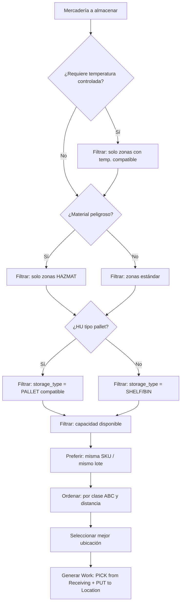
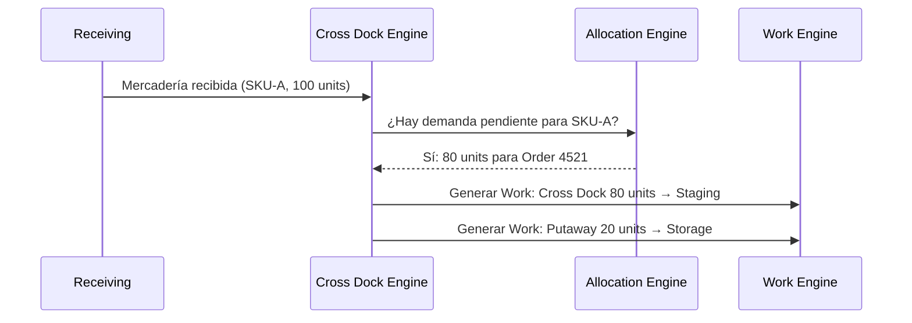
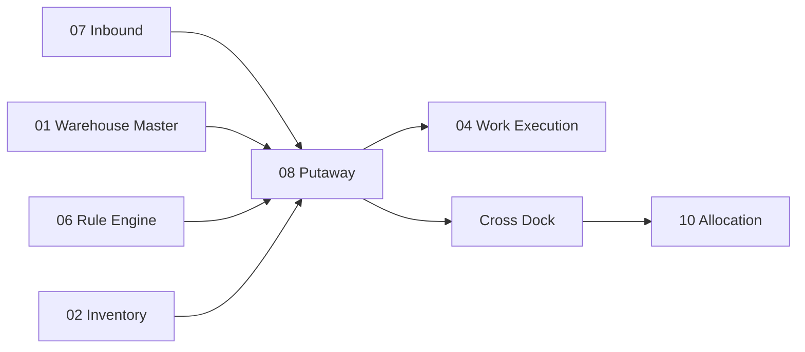

# Putaway — Almacenamiento Dirigido y Cross Dock

> El Putaway Engine responde la pregunta más fundamental del almacenamiento: "¿Dónde debo guardar esto?" El Cross Dock Engine decide cuándo no almacenar en absoluto.

---

## Contexto

### ¿Qué es Putaway?

**Putaway** (Almacenamiento Dirigido) es el proceso de determinar la ubicación óptima para almacenar mercadería que acaba de ser recibida o que necesita ser reubicada. No es simplemente "ponlo donde haya espacio", sino una decisión algorítmica basada en múltiples factores.

### ¿Qué es Cross Dock?

**Cross Dock** (Cruce de Muelle) es una estrategia donde la mercadería recibida se desvía directamente a outbound (despacho) sin pasar por almacenamiento. Reduce tiempos y manipulación cuando hay demanda urgente que coincide con lo que se recibe.

---

## Diseño Funcional del Putaway Engine

### La Pregunta Central

> ¿Dónde debo almacenar esta HU/mercadería?

### Factores de Decisión

El Putaway Engine evalúa múltiples variables para determinar la ubicación óptima:

| Factor | En inglés | Significado | Ejemplo |
|---|---|---|---|
| **Bodega** | Warehouse | En qué bodega almacenar | SCL01 |
| **Zona** | Zone | Zona compatible con el producto | FREEZER, DRY, HAZMAT |
| **Tipo de almacenamiento** | Storage Type | Tipo de rack/piso requerido | PALLET_RACK, FLOOR, SHELF |
| **Producto** | Product | SKU específico | Si tiene ubicación preferente |
| **Categoría** | Category | Familia del producto | Alimentos, electrónica |
| **Clase ABC** | ABC Class | Clasificación por rotación | A = alta rotación → cerca de despacho |
| **Velocidad** | Velocity | Frecuencia de movimiento | Fast mover → pick face |
| **HU** | Handling Unit | Tipo y dimensiones del contenedor | Pallet americano, euro pallet |
| **Peso** | Weight | Peso total de la HU | Determina nivel de rack |
| **Volumen** | Volume | Espacio requerido | Verifica capacidad de la ubicación |
| **Temperatura** | Temperature | Requisito de cadena de frío | -18°C a -20°C |
| **Peligrosidad** | Hazardous | Clase de material peligroso | Clase 3: líquidos inflamables |
| **Lote** | Lot | Lote del producto | Agrupar mismo lote |
| **Propietario** | Owner | Dueño del inventario (3PL) | Separar por propietario |
| **Mismo SKU** | Same SKU | ¿Hay más del mismo producto en esa ubicación? | Consolidar |
| **Mismo lote** | Same Lot | ¿Hay más del mismo lote? | Agrupar por trazabilidad |
| **Capacidad disponible** | Available Capacity | ¿Cabe físicamente? | Peso, volumen, # de HU |
| **Distancia** | Distance | ¿Qué tan lejos está de la zona de recepción? | Minimizar viaje |
| **Consolidación** | Consolidation | ¿Conviene consolidar con inventario existente? | Reducir fragmentación |

### Algoritmo de Putaway (Simplificado)



### Ejemplo Operacional

```text
Input:
  Product: SKU-A (Frozen, ABC class: A)
  HU: PALLET, 1,200 kg
  Lot: L00231

Evaluación:
  1. Temperatura = FROZEN → solo FREEZER zone
  2. HU = PALLET → solo PALLET_RACK o FLOOR
  3. Peso 1,200 kg → niveles 1-2 del rack (no nivel 4+)
  4. ABC = A → cercano a zona de picking
  5. ¿Hay mismo SKU+Lote en alguna ubicación? → Consolidar
  6. ¿Capacidad disponible? → Verificar

Resultado:
  Location: FREEZER-A03-R02-L01
  Reason: Same SKU consolidation + closest available
```

### Relación con Odoo

Odoo 19 ya dispone de **storage categories** (categorías de almacenamiento) y capacidades básicas de putaway. Aprovecharemos esa información base y agregaremos nuestro motor de selección avanzado por encima.

| Funcionalidad | Odoo estándar | WMS Extension |
|---|---|---|
| Storage categories | ✅ Básicas | Extendidas con más restricciones |
| Putaway rules | ✅ Simples (product → location) | Motor multi-variable |
| Capacity check | ✅ Básico (weight/qty) | Peso + volumen + HU + restricciones |
| ABC class | ❌ | ✅ Nuevo |
| Consolidation | ❌ | ✅ Nuevo |
| Temperature routing | ❌ | ✅ Nuevo |

### Referencia: Dynamics 365

Microsoft Dynamics utiliza **Location Directives** (Directivas de Ubicación) para determinar ubicaciones de PICK y PUT. Es un concepto similar a nuestro Putaway Engine pero con una interfaz configurable de reglas secuenciales.

---

## Diseño Funcional del Cross Dock Engine

### ¿Cuándo aplicar Cross Dock?

```text
Inbound:                          Outbound urgente:
100 SKU-A (recibiendo)            80 SKU-A (pedido pendiente)

                 ┌→ 80 Cross Dock → Outbound (sin almacenar)
Receiving → 100 ─┤
                 └→ 20 Putaway (almacenar normalmente)
```

### Condiciones para Cross Dock

El sistema evalúa automáticamente al momento de la recepción:

| Condición | Significado |
|---|---|
| Existe demanda outbound pendiente | Hay un pedido sin stock asignado |
| El producto recibido coincide | El SKU y lote son compatibles |
| La demanda es urgente o tiene deadline cercano | Prioridad de despacho |
| El inventario no necesita quality hold | Si requiere inspección, no aplica cross dock |
| La regla de cross dock está activa | Configurable por bodega/producto/cliente |

### Flujo de Cross Dock



### Beneficios

| Beneficio | Descripción |
|---|---|
| **Reduce tiempo** | Mercadería va directo a despacho sin almacenamiento |
| **Reduce manipulación** | Menos movimientos = menos daño, menos costo |
| **Acelera entrega** | El pedido urgente se cumple más rápido |
| **Libera capacidad** | Menos mercadería entra a las zonas de almacenamiento |

### Referencia: Dynamics 365

Dynamics contempla **planned cross-docking** como funcionalidad estándar de su Warehouse Management, validando que nuestro enfoque es consistente con las mejores prácticas de la industria.

---

## Modelos Nuevos

| Modelo | Propósito |
|---|---|
| `wms.putaway.strategy` | Estrategia de almacenamiento configurable |
| `wms.putaway.result` | Resultado de la evaluación (ubicación sugerida + razón) |
| `wms.crossdock.rule` | Reglas para evaluar elegibilidad de cross dock |
| `wms.crossdock.match` | Match entre inbound y outbound para cross dock |

---

## Dependencias



---

## Referencias

- [Dynamics 365 — Location Directives](https://learn.microsoft.com/en-us/dynamics365/supply-chain/warehousing/create-location-directive)
- [Odoo 19 — Storage Categories](https://www.odoo.com/documentation/19.0/applications/inventory_and_mrp/inventory/shipping_receiving/daily_operations/storage_category.html)
- [Dynamics 365 — Planned Cross Docking](https://learn.microsoft.com/en-us/dynamics365/supply-chain/warehousing/planned-cross-docking)

---

*Documento derivado de las secciones 17-18 del [Plan Maestro](../plan.md).*
