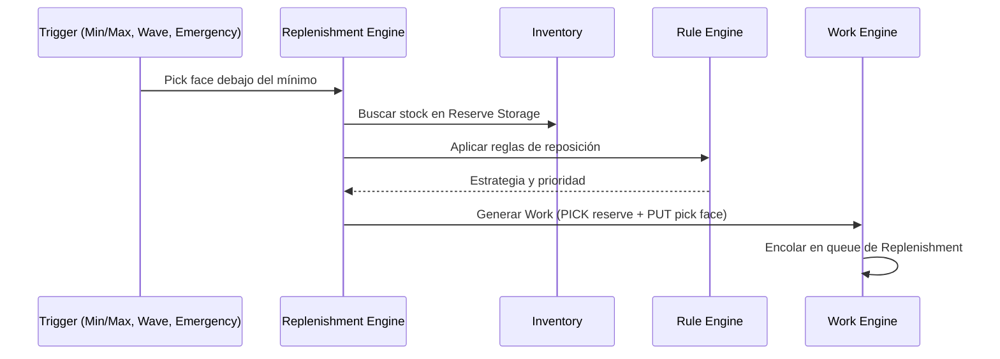
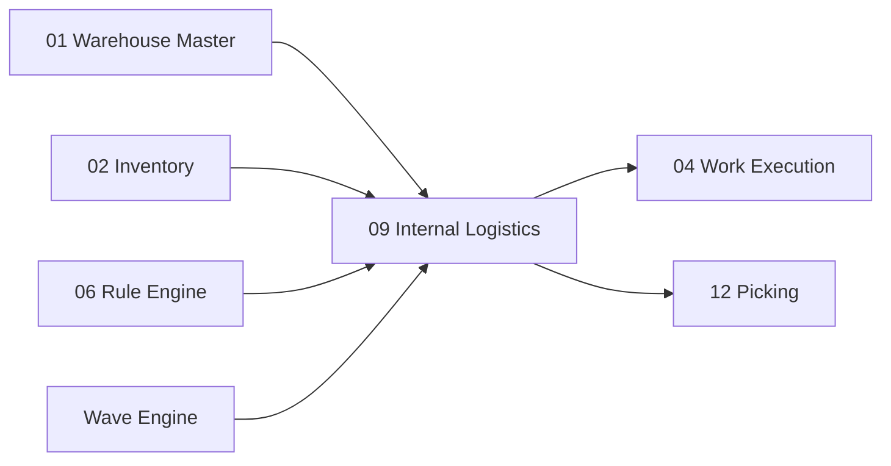

# Internal Logistics — Replenishment y Slotting

> Procesos internos que mantienen el almacén operativamente eficiente: reposición de ubicaciones de picking y optimización de la ubicación permanente de cada SKU.

---

## Contexto

### ¿Por qué separar Reserve Storage y Pick Face?

En un almacén industrial, el inventario se divide en dos tipos de ubicaciones:

| Tipo | En inglés | Propósito | Ubicación típica |
|---|---|---|---|
| **Reserva** | Reserve Storage | Almacenamiento a largo plazo, pallets completos | Racks altos (niveles 3-5) |
| **Cara de Picking** | Pick Face | Ubicación accesible desde donde el operador recolecta unidades | Racks bajos (nivel 1-2), estanterías |

```text
RACK
  Level 5  ▓▓▓▓  ← Reserve Storage (pallets completos)
  Level 4  ▓▓▓▓  ← Reserve Storage
  Level 3  ▓▓▓▓  ← Reserve Storage
  Level 2  ░░░░  ← Pick Face (operador accede a pie o con transpaleta)
  Level 1  ░░░░  ← Pick Face (nivel de piso, fácil acceso)
```

Cuando la **pick face** se vacía, se debe **reponer** desde la **reserva**. Este proceso es el **Replenishment**.

---

## Replenishment Engine — Motor de Reposición

### ¿Qué es Replenishment?

**Replenishment** (Reposición) es el proceso automático de mover inventario desde ubicaciones de reserva a ubicaciones de picking cuando éstas bajan de un nivel mínimo. Sin reposición, los operadores de picking encuentran ubicaciones vacías y no pueden completar los pedidos.

### Estrategias de Reposición

| Estrategia | En inglés | Significado | Cuándo se usa |
|---|---|---|---|
| **Mín/Máx** | Min/Max | Cuando el stock en pick face baja del mínimo, reponer hasta el máximo | Productos de rotación estable |
| **Por Demanda** | Demand Driven | Reponer exactamente lo que se necesita para las órdenes pendientes | Cuando hay waves planificadas |
| **Por Wave** | Wave Driven | Reponer lo necesario para completar la wave actual antes de iniciar picking | Operación por olas |
| **Top Off** | Top Off | Llenar la pick face al máximo durante períodos de baja actividad (ej: turno nocturno) | Preparación anticipada |
| **Emergencia** | Emergency | Reposición urgente cuando un operador encuentra ubicación vacía durante picking | Situación reactiva |
| **Ubicación vacía** | Empty Location | Reponer automáticamente cualquier pick face que llegue a cero | Alta rotación |

### Ejemplo Operacional: Min/Max

```text
Pick Face para SKU-A:
  Ubicación: A03-R01-L01
  Current stock = 40 units
  Min = 100 units
  Max = 600 units

40 < 100 → TRIGGER REPLENISHMENT

Cantidad a reponer: Max - Current = 600 - 40 = 560 units

Reserve Storage:
  A03-R01-L04 tiene PALLET con 480 units
  A03-R02-L05 tiene PALLET con 480 units

→ Work generado: 
  PICK 560 units from A03-R01-L04
  PUT to A03-R01-L01
```

### Ejemplo Operacional: Wave Driven

```text
Wave 20260817-02 requiere:
  SKU-A: 400 units
  SKU-B: 200 units
  SKU-C: 50 units

Pick Face actual:
  SKU-A: 120 units   → Faltante: 280
  SKU-B: 350 units   → Suficiente ✓
  SKU-C: 10 units    → Faltante: 40

→ Generar replenishment ANTES de liberar la wave:
  Work 1: Replenish SKU-A +280
  Work 2: Replenish SKU-C +40
  
→ Luego liberar picking de Wave
```

### Flujo de Replenishment



### Referencia: Dynamics 365

Dynamics modela **replenishment templates** como reglas que determinan cuándo y cómo reponer una ubicación, validando nuestro enfoque de configuración declarativa.

---

## Slotting Engine — Motor de Ubicación Óptima

### ¿Cuál es la diferencia entre Putaway y Slotting?

| Concepto | Pregunta que responde | Horizonte |
|---|---|---|
| **Putaway** | ¿Dónde guardo esto **ahora**? | Inmediato (este pallet que acabo de recibir) |
| **Slotting** | ¿Dónde **debería vivir normalmente** este SKU? | Estratégico (optimización periódica) |

Putaway es una decisión *operacional inmediata*. Slotting es un *análisis estratégico* que redefine la asignación óptima de ubicaciones.

### ¿Qué es Slotting?

**Slotting** (Asignación de Ubicaciones) es el proceso de analizar datos históricos y operacionales para determinar la ubicación ideal de cada SKU dentro del almacén. El objetivo es minimizar el tiempo de viaje de picking y maximizar la eficiencia operativa.

### Variables de Análisis

| Variable | En inglés | Significado | Impacto |
|---|---|---|---|
| **Velocidad** | Velocity | Frecuencia de movimiento del SKU | SKU rápido → cerca de despacho |
| **Afinidad de pedido** | Order Affinity | Productos que frecuentemente se piden juntos | Ubicar cerca entre sí |
| **Tamaño** | Size | Dimensiones del producto | Determina tipo de ubicación |
| **Peso** | Weight | Peso del producto | Niveles bajos para pesados |
| **Picks por día** | Picks/Day | Cantidad de recolecciones diarias | Alta → ubicación ergonómica |
| **Estacionalidad** | Seasonality | Variación de demanda por temporada | Reubicar antes de temporada alta |
| **Distancia de viaje** | Travel Distance | Metros recorridos para recolectar | Minimizar recorrido total |
| **Frecuencia de reposición** | Replenishment Frequency | Qué tan seguido se repone la pick face | Reducir con mejor slotting |

### Ejemplo de Recomendación

```text
SKU-A

Current Location:
  A98 (fondo del almacén)
  
Analysis:
  Picks/day: 87
  ABC class: A
  Order affinity with SKU-B: 72%
  
Recommended Location:
  A03 (cerca de despacho, mismo pasillo que SKU-B)

Expected travel reduction: 23%
Expected picks/hour improvement: +15%
```

### Modos de Operación

| Fase | Modo | Descripción |
|---|---|---|
| **Inicial** | Analítico / Recomendación | El sistema analiza y genera reportes con sugerencias |
| **Intermedio** | Semi-automático | Genera propuestas que un supervisor aprueba, luego genera Work de reubicación |
| **Avanzado** | Automatizado | Genera y ejecuta movimientos de slotting automáticamente en horarios de baja actividad |

### Salida del Slotting

El Slotting Engine produce:

1. **Reportes de análisis**: qué SKUs están mal ubicados y por qué
2. **Recomendaciones**: nueva ubicación sugerida con beneficio esperado
3. **Work de reubicación** (cuando se aprueba): movimientos físicos para reubicar SKUs

---

## Modelos Nuevos

| Modelo | Propósito |
|---|---|
| `wms.replenishment.rule` | Regla de reposición (min/max, demand driven, etc.) |
| `wms.replenishment.trigger` | Evento que dispara una reposición |
| `wms.slotting.analysis` | Resultado de análisis de slotting |
| `wms.slotting.recommendation` | Recomendación de nueva ubicación |
| `wms.pick.face` | Definición de ubicaciones de picking con sus reglas |

---

## Dependencias



---

## Referencias

- [Dynamics 365 — Replenishment](https://learn.microsoft.com/en-us/dynamics365/supply-chain/warehousing/replenishment-over-location-capacity)

---

*Documento derivado de las secciones 19-20 del [Plan Maestro](../plan.md).*
