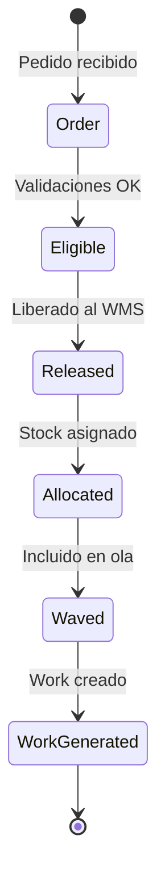
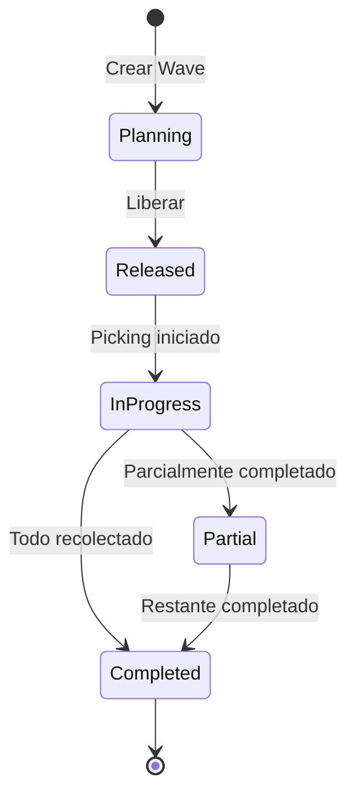
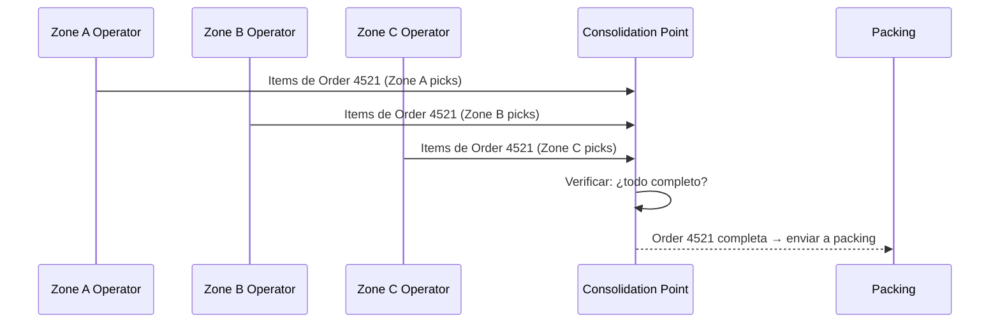
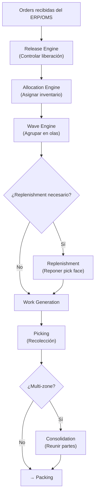
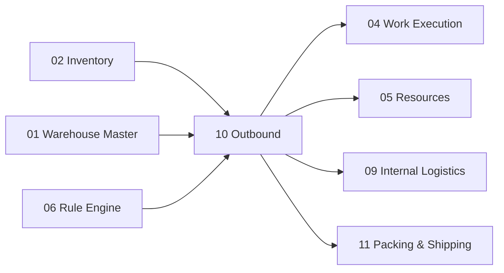

# Outbound — Allocation, Waves, Picking, Route Optimization y Consolidation

> El flujo outbound completo: desde la liberación de pedidos hasta la consolidación de mercadería recolectada, pasando por asignación de inventario, planificación de olas, y múltiples estrategias de picking.

---

## Contexto

El proceso **Outbound** (Salida) es la cadena de decisiones y acciones que transforma pedidos de clientes en mercadería recolectada, lista para empaque y despacho. Es donde se concentra la mayor complejidad operativa del WMS porque involucra:

- Decisiones de qué inventario comprometer (Allocation)
- Agrupación inteligente de pedidos (Waves)
- Múltiples estrategias de recolección (Picking)
- Optimización de recorridos (Route Optimization)
- Unificación de partes de un pedido (Consolidation)

---

## 1. Outbound Release Engine — Motor de Liberación de Salida

### ¿Por qué no generar picking inmediatamente?

No todos los pedidos deberían generar picking de forma inmediata. Un almacén con 10,000 pedidos diarios colapsaría si intentara procesar todo al mismo tiempo. El **Release Engine** controla **cuándo** y **cuántos** pedidos entran al flujo de ejecución.

### Estados del Pedido Outbound



| Estado | En inglés | Significado |
|---|---|---|
| **Pedido** | Order | Pedido recibido del OMS/ERP, no procesado aún |
| **Elegible** | Eligible | Validaciones comerciales y de crédito OK, puede ser liberado |
| **Liberado** | Released | Ingresó al WMS, pendiente de asignación de inventario |
| **Asignado** | Allocated | Inventario específico comprometido para este pedido |
| **En ola** | Waved | Incluido en una ola operativa para procesamiento |
| **Trabajo generado** | Work Generated | Se crearon los Works de picking |

### Control de Carga Operativa

El Release Engine permite:

| Control | Significado |
|---|---|
| **Throttling** (regulación) | Liberar máximo N pedidos por hora |
| **Priority** (prioridad) | Liberar primero los pedidos urgentes / premium |
| **Cutoff** (hora de corte) | Solo liberar pedidos que alcancen el corte de transporte |
| **Capacity** (capacidad) | No liberar más de lo que pueden procesar los recursos disponibles |

---

## 2. Allocation Engine — Motor de Asignación de Inventario

### ¿Qué hace?

Cuando un pedido dice "200 unidades de SKU-A", el Allocation Engine responde: **¿qué inventario específico debo comprometer?**

No es tan simple como "hay 200 disponibles". El engine debe decidir *cuáles* 200, de qué ubicación, de qué lote, de qué pallet.

### Estrategias de Asignación

| Estrategia | En inglés | Significado | Cuándo se usa |
|---|---|---|---|
| **FIFO** | First In First Out | Asignar el inventario más antiguo primero (por fecha de entrada) | Default para no-perecederos |
| **FEFO** | First Expiry First Out | Asignar el inventario con fecha de expiración más cercana | Alimentos, farmacéuticos |
| **LIFO** | Last In First Out | Asignar el inventario más reciente | Materiales a granel |
| **Más cercano** | Closest | Asignar inventario de la ubicación más cercana al área de despacho | Minimizar viaje |
| **Pallet completo** | Full Pallet | Preferir asignar pallets completos (evitar abrir pallets innecesariamente) | Despacho de pallets |
| **Caja completa** | Full Box | Preferir asignar cajas completas | Reducir piezas sueltas |
| **Menor fragmentación** | Least Fragmentation | Minimizar la cantidad de ubicaciones distintas de donde se toma | Reducir viajes |
| **Reglas del cliente** | Customer Rules | Reglas específicas por cliente (ej: "solo lote certificado") | Contratos especiales |
| **Ruta** | Route | Asignar considerando la ruta de transporte | Optimizar carga |

### Ejemplo de Decisión

```text
Demanda: 200 units de SKU-A para Order 4521

Inventario disponible:
  Location A03: 120 units, Lot L001, arrived 2026-08-10
  Location A07: 80 units, Lot L002, arrived 2026-08-15
  Location B12: 300 units, Lot L001, arrived 2026-08-12 (pallet completo)

Estrategia: FIFO + Least Fragmentation

Resultado:
  → 200 from B12 (Lot L001, arrived 2026-08-12)
  → Razón: pallet con suficiente stock y fecha más antigua compatible
  → Se toman 200 de un solo lugar (menor fragmentación)
```

### Relación con Odoo

Odoo 19 ya implementa estrategias FIFO, LIFO, FEFO y closest location a nivel de **removal strategies** (estrategias de remoción). Nuestra capa extiende esto con:
- Evaluación de pallet completo / caja completa
- Fragmentación mínima
- Reglas por cliente
- Combinación de múltiples estrategias con pesos

---

## 3. Wave Engine — Motor de Olas

### ¿Qué es una Wave?

Una **Wave** (Ola) es una agrupación de múltiples pedidos u órdenes de salida en una **unidad operativa coherente** que se procesa conjuntamente. Es como un "lote de trabajo" que agrupa pedidos que tienen algo en común.

### ¿Por qué agrupar en Waves?

| Beneficio | Explicación |
|---|---|
| **Eficiencia de recorrido** | Un operador recolecta para 20 pedidos en un solo viaje |
| **Control de cutoff** | Todos los pedidos para el camión de las 16:00 se procesan juntos |
| **Balance de carga** | Se puede dimensionar cada wave según la capacidad disponible |
| **Coordinación** | Picking, packing, staging y loading se coordinan por wave |

### Ejemplo de Wave

```text
WAVE 20260817-01

Cutoff: 16:00                    ← Hora límite de despacho
Carrier: Carrier A               ← Transportista
Zone: 1/2                        ← Zonas del almacén involucradas
Orders: 1,240                    ← Cantidad de pedidos
Lines: 4,890                     ← Líneas de pedido totales
Units: 18,200                    ← Unidades totales a recolectar
```

### Criterios de Agrupación

| Criterio | Significado |
|---|---|
| **Carrier** (transportista) | Agrupar pedidos que van con el mismo carrier |
| **Ruta** | Pedidos con la misma ruta de transporte |
| **Zona del almacén** | Pedidos que se recolectan de las mismas zonas |
| **Cutoff** | Pedidos que deben despacharse antes de la misma hora |
| **Prioridad** | Pedidos de la misma prioridad |
| **Tipo de cliente** | Premium, estándar, etc. |
| **Volumen/peso** | Para no exceder capacidad de procesamiento |

### Ciclo de Vida de la Wave



### Referencia: Dynamics 365 y SAP

Dynamics considera **Wave Templates** una pieza central de Warehouse Management. SAP utiliza waves para crear warehouse orders/tasks. Ambos sistemas validan que las olas son un patrón esencial para operaciones de volumen.

---

## 4. Picking Engine — Motor de Recolección

### ¿Qué es Picking?

**Picking** (Recolección) es el proceso de extraer mercadería de las ubicaciones de almacenamiento para cumplir pedidos. Es la operación que más trabajo genera en un almacén (típicamente 50-60% del costo operativo).

### Estrategias de Picking

El WMS debe soportar múltiples estrategias desde el diseño:

| Estrategia | En inglés | Cómo funciona | Cuándo se usa |
|---|---|---|---|
| **Discreto** | Discrete | Un operador → un pedido completo | Pedidos pequeños, alta prioridad |
| **Por lote** | Batch | Un operador → múltiples pedidos en un viaje | Pedidos con productos similares |
| **Por ola** | Wave | Grupo de operadores → una wave completa | Operación de alto volumen |
| **Cluster** | Cluster | Un operador con carro multi-contenedor → varios pedidos simultáneamente | E-commerce, piezas pequeñas |
| **Por zona** | Zone | Cada operador recolecta solo en su zona, el pedido pasa de zona en zona | Almacenes grandes |
| **Pick and Pass** | Pick & Pass | Similar a zona pero con movimiento del contenedor entre zonas | Líneas de producción |
| **Por caja** | Case | Recolección de cajas completas (no unidades sueltas) | Distribución mayorista |
| **Por pieza** | Piece | Recolección unidad por unidad | E-commerce, piezas pequeñas |
| **Pallet completo** | Full Pallet | Se toma el pallet entero sin abrirlo | Distribución a granel |
| **Dos pasos** | Two-Step | Primero recolectar a zona de staging, luego clasificar por pedido | Alto volumen + consolidación |
| **Multi-pedido** | Multi-Order | Recolectar para múltiples pedidos y clasificar al final | Optimización de recorrido |

### Ejemplo: Batch Picking

```text
Batch: BATCH-2026-0817-001
Operador: Juan (Zone A)

Recorrido optimizado:
  1. A01-R01-L01 → SKU-X × 3 (Order 1) + SKU-X × 2 (Order 5)
  2. A01-R03-L02 → SKU-Y × 1 (Order 2)
  3. A02-R01-L01 → SKU-Z × 4 (Order 1) + SKU-Z × 1 (Order 3)
  4. A03-R02-L01 → SKU-W × 2 (Order 4)

Total: 4 ubicaciones visitadas para 5 pedidos
Vs. discreto: 12 ubicaciones (3+2+3+2+2 visitas individuales)

Ahorro: 67% menos viajes
```

### Diferencia clave: `stock.picking.batch` ≠ `wms.work`

Odoo Community 19 incluye `stock_picking_batch` que maneja batch y wave. Pero:

```text
stock.picking.batch     ≠    wms.work
```

| Concepto | `stock.picking.batch` | `wms.work` |
|---|---|---|
| **Nivel** | Agrupa operaciones logísticas | Representa ejecución física |
| **Perspectiva** | Backoffice / planificación | Operador en piso |
| **Granularidad** | Múltiples pickings | Pasos individuales: PICK + PUT |

Podemos reutilizar `stock.picking.batch` para la agrupación lógica, pero el operador ejecutará a través de `wms.work`.

---

## 5. Route Optimization — Optimización de Rutas

### ¿Por qué importa?

El picking necesita **secuenciar ubicaciones** para minimizar el recorrido del operador. Un almacén grande puede tener pasillos de 100m; la diferencia entre un recorrido optimizado y uno aleatorio puede ser del 40%.

### Evolución Progresiva

| Fase | Enfoque | Implementación |
|---|---|---|
| **Inicial** | Secuencia fija | Cada ubicación tiene un `picking_sequence` numérico. El operador sigue el orden |
| **Intermedia** | Grafo del almacén | Se modela la bodega como un grafo y se calcula el camino más corto (*shortest path*) |
| **Avanzada** | Optimización dinámica | Algoritmo que reordena el recorrido considerando carga actual, congestión, equipos cercanos |

### Requisito del Modelo Inicial

Aunque la optimización avanzada se implemente después, **desde el modelo inicial debemos guardar**:
- Coordenadas o secuencias de cada ubicación
- Topología del almacén (qué pasillos conectan con qué)
- Distancias entre zonas clave

Sin estos datos, la optimización posterior sería imposible.

---

## 6. Consolidation — Consolidación

### ¿Qué es?

Cuando un pedido grande se divide en múltiples zonas de picking (zone picking), distintos operadores preparan partes del mismo pedido. **Consolidation** (Consolidación) es el proceso de reunir todas las partes en un punto antes de empacar.

```text
ZONE A ─┐
ZONE B ─┼→ CONSOLIDATION POINT → ORDER completa → PACKING
ZONE C ─┘
```

### Entidades

| Entidad | En inglés | Significado |
|---|---|---|
| **Punto de consolidación** | Consolidation Point | Ubicación física donde se reúnen las partes |
| **Contenedor de pedido** | Order Container | Carro o contenedor asignado a un pedido |
| **Contenido esperado** | Expected Contents | Lo que debería llegar de cada zona |
| **Contenido recibido** | Received Contents | Lo que efectivamente llegó |
| **Excepciones** | Exceptions | Faltantes o sobrantes |

### Flujo



---

## Flujo Outbound Completo



---

## Modelos Nuevos

| Modelo | Propósito |
|---|---|
| `wms.outbound.order` | Orden de salida con estado y prioridad |
| `wms.allocation` | Resultado de asignación: qué stock para qué orden |
| `wms.wave` | Ola operativa con criterios y estado |
| `wms.wave.template` | Plantilla de criterios de agrupación |
| `wms.picking.strategy` | Estrategia de picking configurada por zona/producto |
| `wms.consolidation` | Punto y estado de consolidación por pedido |

---

## Dependencias



---

## Referencias

- [Odoo 19 — Removal Strategies](https://www.odoo.com/documentation/19.0/applications/inventory_and_mrp/inventory/shipping_receiving/removal_strategies.html)
- [Dynamics 365 — Warehouse Configuration](https://learn.microsoft.com/en-us/dynamics365/supply-chain/warehousing/warehouse-configuration)

---

*Documento derivado de las secciones 21-26 del [Plan Maestro](../plan.md).*
