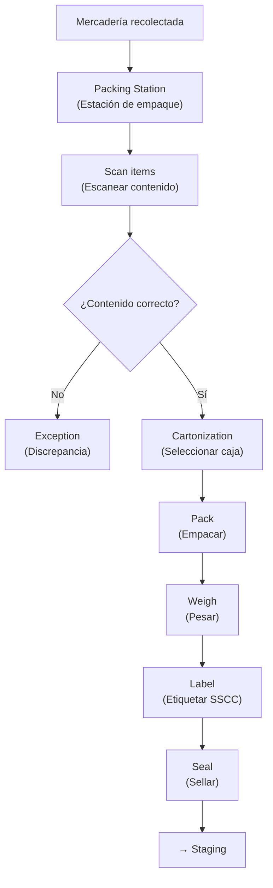
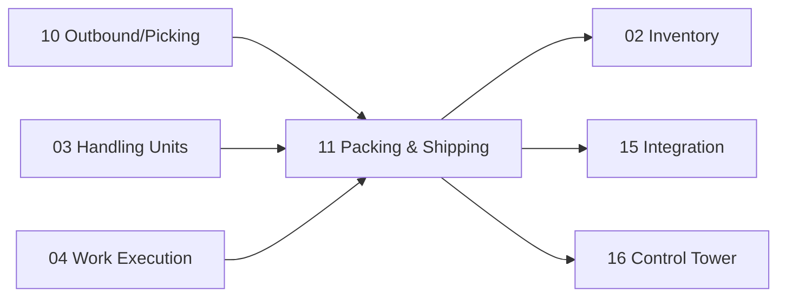

# Packing & Shipping — Empaque, Staging, Loading y Despacho

> Desde la mercadería recolectada hasta su carga en el transporte: empaque, preparación, carga dirigida por RF y cierre de embarque.

---

## Contexto

Una vez que la mercadería ha sido recolectada (picking) y consolidada, entra al flujo de **Packing & Shipping** (Empaque y Despacho). Este flujo abarca cuatro procesos secuenciales: empacar, preparar en staging, cargar en transporte y cerrar el embarque.

---

## 1. Packing Engine — Motor de Empaque

### ¿Qué es?

**Packing** (Empaque) es el proceso de colocar la mercadería recolectada dentro de cajas, asignar etiquetas, verificar contenido y cerrar los paquetes.

### Funciones

| Función | En inglés | Significado |
|---|---|---|
| **Estación de empaque** | Packing Station | Puesto de trabajo fijo con escáner, balanza, impresora de etiquetas |
| **Cartonización** | Cartonization | Algoritmo que determina en qué caja cabe la mercadería con menor desperdicio de espacio |
| **Selección de contenedor** | Container Selection | Elegir el tipo de caja o empaque apropiado |
| **Pesaje** | Weight | Registrar peso real del paquete |
| **Dimensiones** | Dimensions | Registrar largo × ancho × alto reales |
| **SSCC** | SSCC | Asignar código de identificación único al paquete |
| **Jerarquía de paquetes** | Package Hierarchy | Paquetes dentro de cajas dentro de pallets |
| **Etiqueta** | Label | Imprimir y adherir etiqueta de despacho |
| **Verificación** | Verification | Escanear contenido para confirmar que coincide con el pedido |
| **Cierre** | Closing | Sellar el paquete y marcarlo como listo |

### Flujo de Packing



---

## 2. Staging — Preparación de Carga

### ¿Qué es?

**Staging** (Preparación) es una zona temporal donde los paquetes empacados se acumulan antes de ser cargados en el transporte. Se organizan por ruta, carrier (transportista), vehículo y dock.

```text
PACKED
 ↓
STAGING LANE (carril de staging)
 ↓
ROUTE / TRUCK / DOCK
```

### Información que debe conocer

| Dato | Significado |
|---|---|
| **Ruta** | Ruta de transporte asignada |
| **Transportista** | Empresa de transporte |
| **Vehículo** | Camión o van asignado |
| **Embarque** | Shipment al que pertenece |
| **Dock** | Muelle donde se cargará |
| **Secuencia** | Orden de carga (LIFO para descarga eficiente) |

---

## 3. Loading — Carga Dirigida por RF

### ¿Qué es?

**Loading** (Carga) es el proceso físico de subir los paquetes al transporte. El operador usa su terminal RF para validar cada paquete contra el embarque asignado.

### Flujo RF de Loading

```text
SCAN TRUCK                       ← Escanear identificación del camión
 ↓
SCAN DOCK                        ← Confirmar muelle asignado
 ↓
SCAN SSCC                        ← Escanear cada paquete/pallet
 ↓
Validate shipment                ← Sistema valida que corresponde
 ↓
LOAD                             ← Confirmar carga
```

### Validaciones que impide

| Error | En inglés | Qué evita |
|---|---|---|
| **Camión equivocado** | Wrong Truck | Cargar en un transporte que no corresponde |
| **Ruta equivocada** | Wrong Route | Paquete destinado a otra ruta |
| **Embarque equivocado** | Wrong Shipment | HU que pertenece a otro embarque |
| **HU duplicada** | Duplicate HU | Escanear la misma HU dos veces |

---

## 4. Shipping — Cierre de Despacho

### ¿Qué es?

**Shipping** (Despacho) es el proceso de cerrar formalmente un embarque. Implica:

| Acción | Significado |
|---|---|
| Cerrar **shipment** (embarque) | Marcar como despachado |
| Actualizar **inventory** | Reducir stock en sistema |
| Cerrar **HU lifecycle** | Marcar HUs como despachadas |
| Cerrar **work** | Completar works asociados |
| Generar **manifest** (manifiesto) | Documento de carga |
| Enviar **integration events** | Notificar a sistemas externos |

### Eventos generados

El cierre de shipping dispara eventos hacia:

| Destino | En inglés | Qué recibe |
|---|---|---|
| **ERP** | Enterprise Resource Planning | Facturación, contabilidad |
| **TMS** | Transportation Management System | Tracking, rutas |
| **Carrier** | Transportista | Confirmación de despacho, manifiesto |
| **Cliente** | Customer | Notificación de envío, tracking |
| **BI** | Business Intelligence | Datos para analytics |

---

## Modelos Nuevos

| Modelo | Propósito |
|---|---|
| `wms.packing.station` | Estación de empaque con configuración |
| `wms.shipment` | Embarque con estado, ruta, carrier |
| `wms.staging.lane` | Carril de staging con asignación de ruta/dock |
| `wms.loading.validation` | Registro de validaciones de carga |
| `wms.manifest` | Manifiesto de carga generado |

---

## Dependencias



---

*Documento derivado de las secciones 27-30 del [Plan Maestro](../plan.md).*
