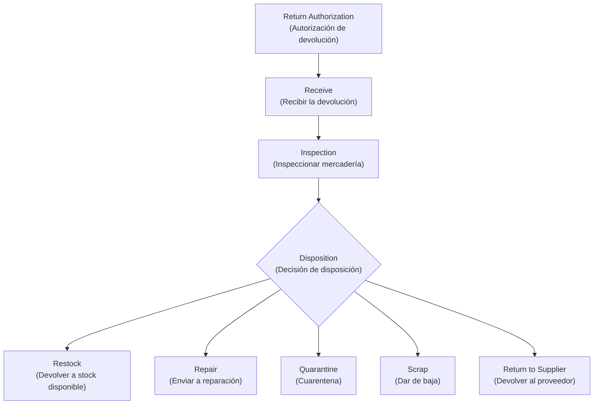

# Reverse Logistics — Logística Inversa

> Gestión completa del flujo de devoluciones: desde la autorización hasta la disposición final de la mercadería retornada.

---

## Contexto

**Reverse Logistics** (Logística Inversa) es el proceso de gestionar mercadería que regresa al almacén. Debe existir desde el diseño porque los retornos generan complejidad: requieren recepción, inspección, decisión de disposición y movimientos físicos, todo con trazabilidad completa.

---

## Flujo de Devoluciones

### Entidades

| Entidad | En inglés | Significado |
|---|---|---|
| **Autorización de devolución** | Return Authorization (RA) | Documento que autoriza la recepción de una devolución |
| **Inspección** | Inspection | Evaluación del estado de la mercadería devuelta |
| **Disposición** | Disposition | Decisión sobre qué hacer con la mercadería |

### Destinos de Disposición

| Destino | En inglés | Significado |
|---|---|---|
| **Devolver a stock** | Restock | Mercadería en buen estado, vuelve a inventario disponible |
| **Reparación** | Repair | Requiere reparación antes de volver a venderse |
| **Cuarentena** | Quarantine | Retener para evaluación adicional |
| **Baja** | Scrap | Destruir o descartar |
| **Devolver a proveedor** | Return to Supplier | Retornar al proveedor por garantía o defecto de fábrica |

Cada disposición genera **Work** automáticamente: mover a zona de reparación, zona de scrap, o ejecutar putaway si vuelve a stock.

---

*Documento derivado de la sección 31 del [Plan Maestro](../plan.md).*
