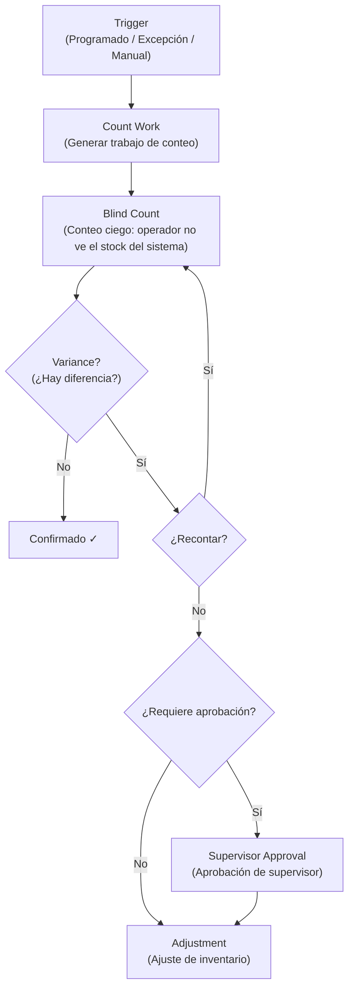

# Inventory Control — Conteo Cíclico

> Gestión de la precisión del inventario a través de conteos programados, ciegos y basados en excepciones, con flujo completo de varianzas y ajustes.

---

## Contexto

**Cycle Counting** (Conteo Cíclico) es la práctica de contar periódicamente subconjuntos del inventario en lugar de hacer un inventario general que detiene la operación. Permite mantener la precisión del inventario de forma continua.

---

## Tipos de Conteo

| Tipo | En inglés | Significado | Cuándo se usa |
|---|---|---|---|
| **ABC** | ABC | Productos clase A se cuentan más frecuentemente que B y C | Default para rotación |
| **Programado** | Scheduled | Conteo en fechas fijas por calendario | Rutina operacional |
| **Saldo cero** | Zero Balance | Contar ubicaciones que el sistema marca como vacías | Verificar que realmente estén vacías |
| **Por ubicación** | Location | Contar todo lo que hay en una ubicación específica | Auditoría de zona |
| **Por SKU** | SKU | Contar un producto específico en todas sus ubicaciones | Discrepancia detectada |
| **Por HU** | HU | Verificar contenido de una HU específica | Validación de pallet |
| **Por excepción** | Exception | Conteo disparado por un short pick u otra anomalía | Reactivo |
| **Alto valor** | High Value | Conteo frecuente de productos de alto valor monetario | Control de pérdidas |

---

## Flujo de Conteo



### Blind Count — Conteo Ciego

Un **Blind Count** (Conteo Ciego) significa que el operador **no ve** la cantidad que el sistema espera. Debe contar desde cero y reportar lo que encuentra. Esto evita el sesgo de "confirmar lo que dice el sistema".

```text
COUNT WORK 45021

LOCATION: A03-R02-L01

SCAN LOCATION
[________________]

PRODUCT: SKU-A
COUNT QTY:
[________________]         ← Operador escribe lo que contó
```

### Varianza y Ajuste

Si la cantidad contada difiere de la del sistema:

| Varianza | Acción |
|---|---|
| Dentro de tolerancia (ej: ±2%) | Ajuste automático |
| Fuera de tolerancia | Requiere reconteo o aprobación de supervisor |
| Alta varianza | Bloquear ubicación, investigar |

---

*Documento derivado de la sección 32 del [Plan Maestro](../plan.md).*
