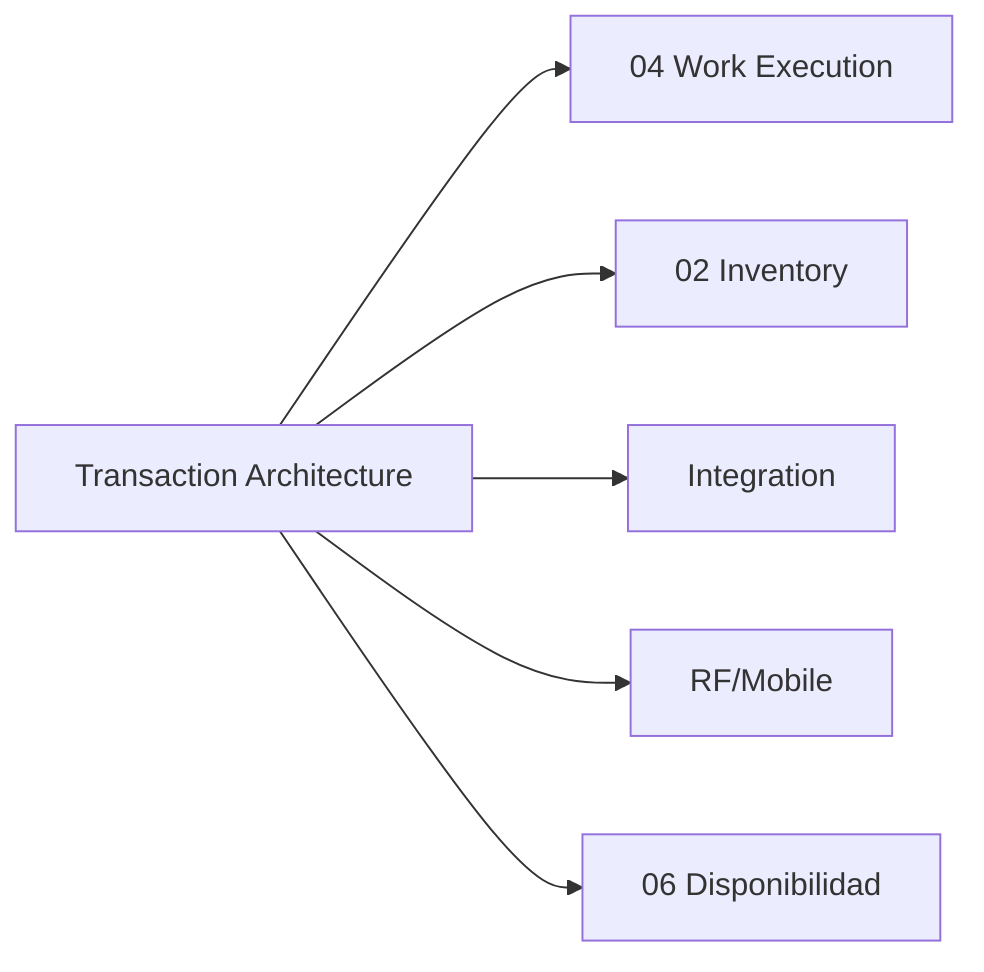

# Transaction Architecture — Invariantes, Boundaries y Locking

> Definición formal de las garantías transaccionales del WMS: qué debe ser atómico, cómo se bloquea, qué es idempotente y cuánto debe durar cada transacción.

---

## Contexto

Un WMS industrial ejecuta miles de transacciones concurrentes contra las mismas tablas (inventory, work, reservations). Sin reglas transaccionales claras, cada desarrollador tomará decisiones diferentes sobre cuándo commitear, qué bloquear y cómo recuperarse de fallos.

Este documento establece contratos transaccionales que **todo el código WMS debe respetar**.

---

## Principio Fundamental

> **Cada operación WMS que modifica estado debe ser una transacción corta, autocontenida e idempotente.**

| Característica | Significado |
|---|---|
| **Corta** | < 200ms típico, < 500ms máximo |
| **Autocontenida** | No depende de estado externo ni de transacciones previas no commiteadas |
| **Idempotente** | Ejecutarla dos veces produce el mismo resultado |

---

## Invariantes del Sistema

Una **invariante** (*invariant*) es una condición que siempre debe ser verdadera en el sistema. Si una invariante se viola, hay un bug.

| ID | Invariante | Consecuencia si se viola |
|---|---|---|
| INV-001 | `stock.quant.quantity >= 0` siempre | Stock negativo → corrupción de inventario |
| INV-002 | `stock.quant.reserved_quantity <= quantity` siempre | Sobre-reserva → picks imposibles |
| INV-003 | Un `wms.work` en estado `ASSIGNED` tiene exactamente un `assigned_resource_id` | Doble asignación → doble pick |
| INV-004 | Un `wms.work` en estado `READY` no tiene `assigned_resource_id` | Work huérfano → operador fantasma |
| INV-005 | `wms.inventory.event` se crea atómicamente con el cambio de `stock.quant` | Event journal incompleto → trazabilidad rota |
| INV-006 | `wms.outbox` se crea atómicamente con la acción que genera el evento | Outbox desincronizado → integraciones inconsistentes |
| INV-007 | La suma de `reserved_quantity` de quants = suma de `product_uom_qty` de moves `assigned` | Reservas desbalanceadas → deadlocks o unreserved inventory |
| INV-008 | Cada `wms.allocation` tiene al menos un quant válido | Allocation sin stock → pick imposible |

---

## Transaction Boundaries por Operación

### Operaciones RF (sub-segundo)

| Operación | Boundary | Tablas tocadas | SLO |
|---|---|---|---|
| **Claim Work** | 1 transacción atómica | `wms_work` | < 50ms p99 |
| **Confirm Pick** | 1 transacción atómica | `stock_quant`, `stock_move_line`, `wms_work_line`, `wms_inventory_event`, `wms_outbox` | < 200ms p99 |
| **Confirm Put** | 1 transacción atómica | `stock_quant`, `stock_move_line`, `wms_work_line`, `wms_inventory_event`, `wms_outbox` | < 200ms p99 |
| **Heartbeat** | 1 transacción atómica | `wms_work` (solo `last_heartbeat_at`, `lease_expires_at`) | < 20ms p99 |
| **Scan Location** | Sin transacción (lectura) | — | < 50ms p99 |
| **Scan Product** | Sin transacción (lectura) | — | < 50ms p99 |

### Operaciones de Planificación (segundos)

| Operación | Boundary | Tablas tocadas | SLO |
|---|---|---|---|
| **Allocation** (por orden) | 1 transacción por orden | `stock_quant` (reserve), `wms_allocation`, `stock_move` | < 500ms p99 |
| **Wave Release** | 1 transacción por wave | `wms_wave`, `wms_work` (bulk create) | < 5s p95 |
| **Replenishment Trigger** | 1 transacción por pick face | `wms_work` | < 200ms p99 |

### Operaciones Batch (minutos, async)

| Operación | Boundary | Worker |
|---|---|---|
| **Wave Planning** | Múltiples transacciones | `wms-worker` |
| **Slotting Analysis** | Read-only, luego transacciones de recomendación | `wms-worker` |
| **Cycle Count Generation** | Múltiples transacciones (1 por count work) | `wms-scheduler` |
| **Outbox Processing** | 1 transacción por mensaje | `wms-integration` |

---

## Locking Strategy

### Regla General

> **Los locks deben adquirirse en el query, no en Python. El query debe ser lo más selectivo posible.**

### Locks por Tabla

| Tabla | Tipo de Lock | Cuándo | Patrón |
|---|---|---|---|
| `wms_work` | `FOR UPDATE SKIP LOCKED` | Claim de trabajo | Concurrencia de 250 operadores |
| `stock_quant` | `FOR UPDATE` | Confirm pick/put | Modificación de inventario |
| `stock_quant` | `FOR UPDATE SKIP LOCKED` | Allocation | Múltiples allocations concurrentes |
| `wms_allocation` | `FOR UPDATE` | Confirm allocation | Exclusividad de reserva |

### Anti-patrones

| Anti-patrón | Problema | Solución |
|---|---|---|
| Lock 50 rows mientras Python calcula score | Bloquea a 50 operadores | Calcular score sin lock, luego atomic claim de 1 row |
| Transacción abierta durante scan del operador | Bloquea filas durante minutos | Transacción corta + lease |
| Lock de tabla completa | Detiene toda la operación | Lock de fila específica |
| Nested transactions | Complejidad, deadlocks potenciales | Una transacción atómica por operación |

---

## Idempotency Contracts

### Regla General

> **ADR-010**: Todos los comandos recibidos externamente son idempotentes.

### Implementación

Cada comando idempotente requiere:

```text
1. Recibir comando con idempotency_key
2. BEGIN
3. SELECT FROM wms_idempotency WHERE key = %s FOR UPDATE
4. Si existe → ROLLBACK, retornar respuesta almacenada
5. Si no existe → ejecutar comando
6. INSERT INTO wms_idempotency (key, response, created_at) VALUES (...)
7. COMMIT
```

### Dónde se aplica

| Componente | Idempotency Key |
|---|---|
| API de integración | Header `X-Idempotency-Key` (UUID del caller) |
| RF commands | `{device_id}:{work_id}:{command_sequence}` |
| Outbox processing | `{event_id}` |
| Inbox processing | `{message_id}` |

---

## Failure Recovery

### Escenarios y Comportamiento

| Escenario | Estado del Work | Inventario | Recuperación |
|---|---|---|---|
| **RF crash durante pick** | IN_PROGRESS | No modificado (pick no confirmado) | Lease expira → RECLAIMABLE |
| **RF crash durante confirm** | Depende de timing | Si COMMIT pasó → modificado. Si no → intacto | Idempotency key protege de duplicado |
| **Worker crash durante wave** | Wave parcial | Solo se crearon works de transacciones commiteadas | Worker retoma works faltantes |
| **DB crash** | Última transacción commiteada | Consistente por ACID | WAL recovery estándar de PostgreSQL |
| **Pod restart** | Works ASSIGNED quedan ASSIGNED | Intacto | Lease expira → RECLAIMABLE |

---

## Performance Budget

Cada operación tiene un presupuesto de tiempo. Si se excede, indica un problema de diseño:

| Operación | Budget | Si se excede |
|---|---|---|
| Claim Work | 50ms | Index missing o lock contention |
| Confirm Pick | 200ms | Transacción demasiado amplia o triggers pesados |
| Heartbeat | 20ms | Network issue |
| Allocation (por orden) | 500ms | Query ineficiente o demasiados candidatos |
| Wave Release | 5s | Batch demasiado grande |

---

## Dependencias



---

*Documento nuevo para v1.1. Define contratos transaccionales que todo el código WMS debe respetar.*
