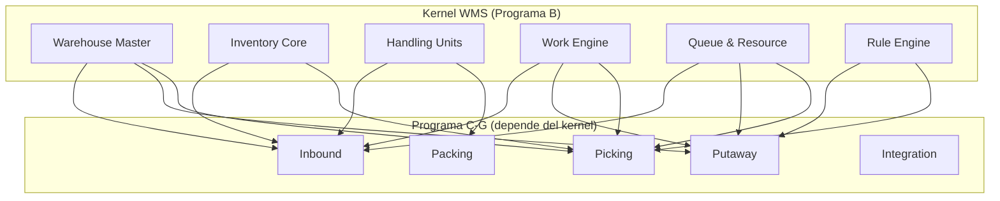

# Programa B — WMS Foundation / Kernel (Fases 4–9)

> Las seis fases que producen el verdadero **kernel WMS**: los componentes sin los cuales nada funciona.

---

## Fases

### Fase 4 — Warehouse Master
**Topología completa** del almacén: bodegas, zonas, áreas de actividad, pasillos, racks, niveles, bins, docks, staging areas, packing stations, quality areas. Con capacidades operacionales en cada ubicación.

→ Detalle completo en [01-dominios/01-warehouse-master.md](../01-dominios/01-warehouse-master.md)

### Fase 5 — Inventory Core
**Stock, disponibilidad, reservación, trazabilidad.** Extensión de `stock.quant` con estados operacionales WMS. Inventory Ledger para registro de eventos.

→ Detalle completo en [01-dominios/02-inventory.md](../01-dominios/02-inventory.md)

### Fase 6 — Handling Units / GS1
**Pallets, cajas, SSCC.** Modelo de HU con jerarquía, operaciones (pack, unpack, split, merge) y ciclo de vida completo.

→ Detalle completo en [01-dominios/03-handling-units.md](../01-dominios/03-handling-units.md)

### Fase 7 — Work Engine
**Work / Work Lines / templates.** El componente más importante: creación, asignación y ejecución de trabajo dirigido.

→ Detalle completo en [01-dominios/04-work-execution.md](../01-dominios/04-work-execution.md)

### Fase 8 — Queue & Resource Engine
**Operarios, equipos, colas, asignación.** Modelo de recursos con capacidades, colas con filtros y assignment engine con scoring.

→ Detalle completo en [01-dominios/05-resources.md](../01-dominios/05-resources.md)

### Fase 9 — Rule Engine
**Configuración declarativa.** Motor de reglas versionadas, auditables, testeables y simulables.

→ Detalle completo en [01-dominios/06-rule-engine.md](../01-dominios/06-rule-engine.md)

---

## Por qué es el Kernel

Estas seis fases producen los componentes que **todos los demás dominios necesitan**:

Sin el kernel, no se puede construir nada operacional.

---

*Documento derivado de las Fases 4-9 del [Plan Maestro](../plan.md).*
