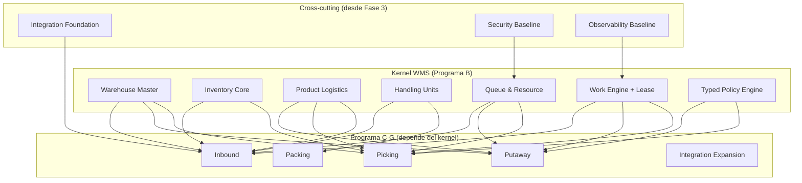

# Programa B — WMS Foundation / Kernel (Fases 4–9+) — v1.2

> Las fases que producen el verdadero **kernel WMS**: los componentes sin los cuales nada funciona.
>
> **v1.2**: Agrega Product Logistics Master al kernel (ADR-024), Integration Foundation, Security Baseline y Observability Baseline como capacidades transversales (ADR-023). Corrige descripciones para alinear con ADR-011/012/013/018.

---

## Fases del Kernel

### Fase 4 — Warehouse Master
**Topología completa** del almacén: bodegas, zonas, áreas de actividad, pasillos, racks, niveles, bins, docks, staging areas, packing stations, quality areas. Con `wms_location_role` (ADR-026) para semántica WMS sin modificar `stock.location.usage`.

→ Detalle completo en [01-dominios/01-warehouse-master.md](../01-dominios/01-warehouse-master.md)

### Fase 5 — Inventory Core
**Stock, disponibilidad, reservación, trazabilidad.** `stock.quant` como fuente de verdad SIN modificar su identidad lógica (ADR-011/012). Estados operacionales implementados vía `wms_location_role` y `wms.inventory.block` con scope dimensions. Event Journal transaccional para operaciones WMS.

→ Detalle completo en [01-dominios/02-inventory.md](../01-dominios/02-inventory.md)

### Fase 5.5 — Product Logistics Master (v1.2)
**Perfil logístico WMS por producto** (ADR-024). Packaging operacionales (pick, case, pallet), configuración Ti-Hi, clasificaciones ABC/velocity, clases de temperatura/hazmat, restricciones de HU, perfiles de storage/putaway/allocation/replenishment.

→ Detalle completo en [01-dominios/00-product-logistics-master.md](../01-dominios/00-product-logistics-master.md)

### Fase 6 — Handling Units / GS1
**Industrialización de `stock.package`** como HU WMS (ADR-013). Ciclo de vida, operaciones (pack, unpack, split, merge), SSCC, operation history. No se crea modelo HU separado.

→ Detalle completo en [01-dominios/03-handling-units.md](../01-dominios/03-handling-units.md)

### Fase 7 — Work Engine
**Work / Work Lines / templates / Lease Protocol** (ADR-015/016). Claim atómico, heartbeat, lease expiry, RECONCILIATION_REQUIRED para IN_PROGRESS offline (ADR-025). `stock.picking ≠ wms.work` (ADR-002).

→ Detalle completo en [01-dominios/04-work-execution.md](../01-dominios/04-work-execution.md)

### Fase 8 — Queue & Resource Engine
**Operarios, equipos, colas, asignación.** Scoring sin locks, atomic claim con retry, race condition handling.

→ Detalle completo en [01-dominios/05-resources.md](../01-dominios/05-resources.md)

### Fase 9 — Typed Policy Engine
**Políticas tipadas por dominio** (ADR-018). Sin `safe_eval`. Actions whitelisted por dominio (putaway, allocation, queue eligibility). Deterministas, validables, simulables.

→ Detalle completo en [01-dominios/06-rule-engine.md](../01-dominios/06-rule-engine.md)

---

## Capacidades Transversales (desde Fase 3)

> **ADR-023**: Security, Observability y Performance son cross-cutting concerns. No esperan a fases tardías.

| Capacidad | Baseline (desde Fase 3) | Hardening (pre-producción) |
|---|---|---|
| **Integration Foundation** | correlation_id, idempotency, outbox, event schema | Enterprise Integration Expansion |
| **Security** | RBAC básico, API auth, scope por warehouse | Penetration testing, audit compliance |
| **Observability** | Métricas por motor, structured logging | Dashboards, alertas, SLO monitoring |
| **Performance** | Performance budget por operación | Load testing, capacity planning |

Cada motor WMS desde su primera versión debe emitir métricas:

```text
Work Engine:    work_claim_latency, work_ready_count, work_assignment_conflict, work_lease_expiration
Inventory:      quant_mutation_count, block_count, event_journal_lag
Queue:          queue_depth, queue_wait_time
Resource:       resource_utilization, assignment_retry_count
```

---

## Por qué es el Kernel

Estas fases producen los componentes que **todos los demás dominios necesitan**:



Sin el kernel, no se puede construir nada operacional.

---

*Documento actualizado en v1.2 para alinear con ADR-011/012/013/018/023/024/025/026.*
